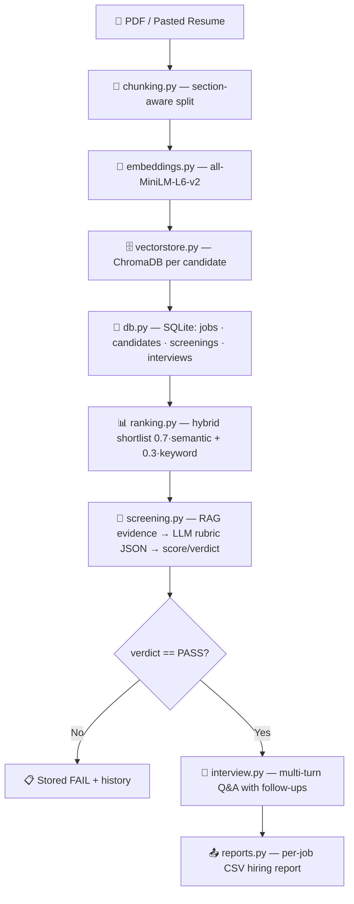

# 🧭 TalentIQ — Complete Project Manual

**Smart AI Recruiter System (RAG Edition) · Phase 2 — Mini-ATS**

This manual is the single source of truth for the project: what every file does, how
the AI pipeline works, how a recruiter uses the app, and how a developer extends it.

---

## Table of Contents

1. [Overview](#1-overview)
2. [System Architecture](#2-system-architecture)
3. [Project Structure — Every File](#3-project-structure--every-file)
4. [Data Model (SQLite)](#4-data-model-sqlite)
5. [The AI Pipeline, Step by Step](#5-the-ai-pipeline-step-by-step)
6. [User Manual — End-to-End Flow](#6-user-manual--end-to-end-flow)
7. [Developer Guide — Module Reference](#7-developer-guide--module-reference)
8. [UI, Theme & Styling Guide](#8-ui-theme--styling-guide)
9. [Configuration & Deployment](#9-configuration--deployment)
10. [Troubleshooting & Known Quirks](#10-troubleshooting--known-quirks)
11. [Roadmap (Phase 3)](#11-roadmap-phase-3)

---

## 1. Overview

TalentIQ is an end-to-end recruitment automation platform built in Python with:

| Layer | Technology |
| :--- | :--- |
| UI | **Gradio 6** (custom theme + CSS) |
| Persistence | **SQLite** (`recruiter.db`) |
| Vector search | **ChromaDB** (`chroma_db/`) |
| Embeddings | **Sentence-Transformers** `all-MiniLM-L6-v2` (local, CPU) |
| Reranking | **Cross-Encoder** `ms-marco-MiniLM-L-6-v2` (optional) |
| LLM | **Groq** `llama-3.3-70b-versatile` with **Ollama** local fallback |

It implements a complete hiring workflow: create requisitions → ingest resumes per job →
hybrid semantic+keyword ranking → LLM rubric deep-screening → multi-turn technical
interviews → per-job CSV hiring reports.

**Design invariants (enforced throughout):**

- **Candidates are job-specific.** There is no global candidate pool — every candidate
  is owned by exactly one job listing and appears only in that job's pipeline, shortlist,
  and reports.
- **Raw internal IDs are never shown in the UI.** Jobs show a human **Req. ID**
  (e.g. `REQ-1001`); tables show names, scores, and timestamps only.
- **Sample data never pollutes real data.** Sample JDs only fill the *create-job form*;
  nothing is seeded into the job list automatically.
- **Local-first.** No resume leaves the machine except the LLM API call (Groq), which
  receives only the retrieved evidence + rubric prompt.

---

## 2. System Architecture



Data flows **left to right**, and every stage persists to SQLite so the UI's History tab
and CSV export can reconstruct the whole journey of a candidate.

---

## 3. Project Structure — Every File

```
AI_Recruiter/
├── app.py            # Entry point — launches the Gradio app
├── ui.py             # The entire UI: layout, handlers, theme, custom CSS
├── db.py             # SQLite persistence layer (all tables + queries)
├── sample_data.py    # Sample JD templates (fill the create-job form only)
├── ranking.py        # Per-job hybrid shortlist (semantic + keyword)
├── screening.py      # RAG deep-screen: evidence → LLM rubric → verdict
├── interview.py      # Multi-turn interview session manager
├── rubric.py         # Weighted rubric math, labels, prompts, badges
├── llm.py            # Unified LLM client (Groq + Ollama fallback)
├── vectorstore.py    # ChromaDB wrapper (index + search)
├── embeddings.py     # Local sentence-transformer wrapper
├── chunking.py       # Section-aware resume chunking + JD requirement split
├── rerank.py         # Optional cross-encoder reranker
├── pdf.py            # PDF → text extraction
├── reports.py        # Per-job CSV export
├── requirements.txt  # Python dependencies
├── MANUAL.md         # This document
├── README.md         # Quick-start + badges
├── exports/          # Generated CSV reports (regenerable)
├── chroma_db/        # ChromaDB vector persistence (generated)
└── recruiter.db      # SQLite database (generated)
```

### File-by-file summary

| File | Role | Key exports |
| :--- | :--- | :--- |
| `app.py` | Entry point. Reads `PORT`, `GRADIO_SERVER_NAME`, `SPACE_ID` so the same file runs locally and on Hugging Face Spaces. | — |
| `ui.py` | Everything the user sees: 5 tabs, ~25 event handlers, the Gradio theme, and ~600 lines of custom CSS. Builds the app once (`demo = build_demo()`). | `build_demo()`, `demo`, `custom_css`, handler functions |
| `db.py` | All SQLite access: schema init + migrations, jobs, candidates, job_candidates links, shortlists, screenings, interviews, audit log. | `init_db`, `create_job`, `upsert_candidate`, `list_candidates`, `delete_job`, `save_screening`, `create_interview`, `jobs_table_rows`, … |
| `sample_data.py` | 3 sample JD titles + descriptions used to pre-fill the create form. No candidates. | `SAMPLE_JOB_DESCRIPTIONS` |
| `ranking.py` | Ranks one job's candidates with hybrid retrieval (no LLM). Persists shortlist snapshots; links ranked candidates to the job pipeline. | `ingest_candidate`, `rank_candidates_for_job`, `rank_and_save_shortlist`, `rank_jobs_batch`, `load_shortlist_results`, `format_ranking_*` |
| `screening.py` | Retrieves per-requirement evidence from Chroma, asks the LLM for a weighted rubric, computes score/verdict, persists the screening row. Also evaluates interview answers. | `ScreeningResult`, `screen_candidate`, `deep_screen_candidate`, `generate_interview_questions`, `evaluate_answers`, `format_screening_markdown` |
| `interview.py` | Session dataclass + start/answer/submit logic, follow-up detection, auto-screening on start, evaluation at the end. | `InterviewSession`, `start_interview`, `submit_answer` |
| `rubric.py` | The weighted dimensions, PASS/FAIL rules, and markdown/badge rendering. | `RUBRIC_WEIGHTS`, `compute_weighted_score`, `apply_verdict`, `verdict_badge`, `rubric_prompt_block` |
| `llm.py` | Unified chat client: Groq (primary) → Ollama (fallback). JSON mode + fence-stripping. | `LLMClient`, `get_llm_client` |
| `vectorstore.py` | ChromaDB collection per resume; index/clear/search with cosine similarity. | `index_resume`, `search_resume`, `clear_candidate` |
| `embeddings.py` | Lazy-loaded `all-MiniLM-L6-v2`. | `embed_texts`, `embedding_dimension` |
| `chunking.py` | Splits resumes by sections (Experience, Skills, Education…) with sliding windows; splits JDs into requirement chunks. | `chunk_resume`, `split_jd_requirements` |
| `rerank.py` | Optional `ms-marco-MiniLM-L-6-v2` cross-encoder rerank of top hits. | `rerank`, `rerank_enabled` |
| `pdf.py` | Extracts text from uploaded PDFs (pypdf). | `extract_pdf_text` |
| `reports.py` | Per-job CSV report with the full pipeline columns. | `export_job_csv` |

---

## 4. Data Model (SQLite)

Schema lives in `db.py` → `init_db()` with automatic migrations for older databases.

| Table | Purpose | Notable columns |
| :--- | :--- | :--- |
| `jobs` | Job requisitions | `id`, `req_id` (REQ-1001…), `title`, `description`, `requirements_json`, `created_at` |
| `candidates` | Resume records | `id` (stable hash of resume), `job_id` (owner listing), `name`, `resume_text`, `source` (pdf/paste/screen), `created_at` |
| `job_candidates` | Link table: candidate ↔ job pipeline with status | `job_id`, `candidate_id`, `status` (shortlisted…), `notes` |
| `shortlists` | Saved ranked snapshots per job | `job_id`, `results_json` (list of `RankResult`), `top_n`, `created_at` |
| `screenings` | Deep-screen results | `job_id`, `candidate_id`, `score`, `verdict`, `summary`, `report_json` (rubric), `evidence_json` |
| `interviews` | Interview sessions | `job_id`, `candidate_id`, `screening_id`, `questions`, `answers`, `messages`, `status`, `average_score`, `verdict`, `eval_json` |
| `audit_log` | Append-only action log | `action`, `entity_type`, `entity_id`, `detail` |

**Key semantics:**

- **Candidate ownership** — `candidates.job_id` is the single owner. `add_candidate_to_job`
  "moves" a candidate to a job (clears other job links, sets `job_id`). This is what makes
  "each candidate belongs to exactly one job listing" true.
- **Deleting a job** (`delete_job`) also deletes its candidates, links, shortlists,
  screenings, and interviews — a full cascade.
- **Stable candidate IDs** — `screening.stable_candidate_id(resume_text)` hashes the resume,
  so re-ingesting the same resume updates the same candidate instead of duplicating it.
- **Req. IDs** — auto-generated `REQ-1001`, `REQ-1002`, … (`_next_req_id`), or a custom ID
  typed by the recruiter (validated for uniqueness).

---

## 5. The AI Pipeline, Step by Step

### 5.1 Ingest (`ranking.ingest_candidate`)

1. Resume text (from PDF or paste) → stable candidate ID (hash).
2. `chunking.chunk_resume` splits text into section-aware chunks (Experience, Skills,
   Education, Projects…), with a sliding window so nothing is lost between sections.
3. `vectorstore.index_resume` embeds each chunk (local model) and stores it in ChromaDB
   under the candidate ID.
4. `db.upsert_candidate` saves the raw text to SQLite.
5. The candidate is immediately linked to its owning job's pipeline
   (`add_candidate_to_job`, status `shortlisted`).

### 5.2 Ranking (`ranking.rank_candidates_for_job`)

No LLM — fast and free.

- JD → requirements via `split_jd_requirements`.
- For each of the job's candidates:
  - **Semantic score (0–100):** for every requirement, retrieve top-2 chunks from the
    candidate's Chroma collection and take the best cosine similarity. Average across
    requirements; blend 60/40 with a global JD similarity.
  - **Keyword score (0–100):** token-overlap ratio between each requirement and the raw
    resume (stop-words filtered).
  - **Hybrid = 0.7 × semantic + 0.3 × keyword.**
- Sort descending, truncate to `top_n`, persist the shortlist snapshot, and link ranked
  candidates to the job pipeline.

### 5.3 Deep Screening (`screening.screen_candidate` / `deep_screen_candidate`)

1. For each JD requirement, retrieve the top-3 most relevant resume chunks
   (reranker enabled by default) → builds an *evidence block* per requirement.
2. The LLM (Groq or Ollama) receives the evidence and is asked to score four weighted
   dimensions on 0–10 with quoted evidence, returning strict JSON:
   - must_have_skills (40%) · experience (25%) · projects (20%) · education_extras (15%)
3. `rubric.compute_weighted_score` → overall /100.
4. **PASS requires overall ≥ 60 AND must-have skills ≥ 5/10** (`apply_verdict`).
5. The result (score, verdict, rubric, evidence, interview focus) is persisted.

### 5.4 Interview (`interview.start_interview` / `submit_answer`)

- Starting an interview auto-screens the candidate if they aren't PASS yet (one LLM call).
  Explicit FAIL candidates are blocked.
- Questions come from the screening report (`generate_interview_questions`, padded to 3).
- Each answer: the LLM decides whether a short follow-up is warranted (vague/short
  answers get one follow-up per core question).
- After all questions, `evaluate_answers` scores the transcript and produces a verdict
  + per-question feedback, persisted to the `interviews` table.

### 5.5 Export (`reports.export_job_csv`)

One CSV per job with columns: rank, candidate_id, name, hybrid/semantic/keyword scores,
screening score+verdict+summary, interview status+avg+verdict. UTF-8 with BOM for Excel.

---

## 6. User Manual — End-to-End Flow

Launch: `python app.py` → open `http://127.0.0.1:7860`.

### Tab 1 — Jobs

1. **Open a requisition**: type a title + paste the JD, or pick a **sample JD** (it only
   fills the form — nothing is auto-added to your lists). Optionally type a custom
   **Req. ID**; leave blank for auto-generation.
2. Click **Create job** → it appears in the **Open roles** table with Req. ID, candidate /
   shortlist / screened counts, and creation date.
3. **Focus job** dropdown drives the rest of the workspace.
4. **Delete a job listing**: pick a job from the dropdown → **Delete selected listing**
   (red button) removes the job *and everything tied to it* — candidates, shortlists,
   screenings, interviews.
5. **Candidate pipeline** for the focus job: tick **Select** boxes → **Remove selected
   from this job** (detaches them) or **Delete selected entirely** (permanent).

### Tab 2 — Talent pool

1. Pick the **Job listing** first — candidates ingested now belong to *that job only*.
2. **Ingest PDFs** (batch) or paste **Resume text** (+ optional name override) → ingest.
3. Edit/remove candidates via the dropdown + editor. The table shows only that job's
   candidates (Name · Source · Created — no raw IDs).

### Tab 3 — Shortlist

1. **Rank selected jobs**: pick one or more jobs (multi-select) → **Rank selected jobs**
   builds an independent ranked shortlist per job (hybrid scores).
2. **Focus job shortlist & deep screen**: pick a job + candidate; **Deep-screen selected**
   runs the LLM rubric and shows a full evidence-backed report (score, verdict badges,
   per-dimension scores, gaps, interview focus).
3. **Deep-screen top N** batch-screens the top N.
4. **Top N for interview** (1–20) controls how many shortlisted candidates flow to the
   Interview tab; the Interview list syncs live.

### Tab 4 — Interview

1. Choose job + candidate (pre-filled from the top-N shortlist with PASS/FAIL/not-screened
   badges; non-PASS candidates auto-screen on start).
2. **Start interview** → the assistant asks Q1.
3. Type each answer in the chat box → **Send** (or Enter). Follow-ups appear when answers
   are thin. After the last question, a full evaluation (per-question + overall verdict)
   is shown and saved.

### Tab 5 — History & export

1. **Filter by job** → screening + interview history tables with PASS/FAIL badges.
2. **Generate CSV report** (per selected job) → **Download CSV**. The file lands in
   `exports/` and is Excel-ready.

---

## 7. Developer Guide — Module Reference

### `app.py`
```python
port = int(os.getenv("PORT", "7860"))
server_name = os.getenv("GRADIO_SERVER_NAME",
    "0.0.0.0" if os.getenv("SPACE_ID") else "127.0.0.1")
demo.launch(server_name=server_name, server_port=port, share=...)
```
Runs `db.init_db()` then serves the pre-built `demo`. Nothing else to change for
deployment — Spaces sets `SPACE_ID`/`PORT` automatically.

### `ui.py` — the wiring hub
- **Module-level helpers** (`_job_choices`, `_candidate_choices`, `_interview_choices`,
  `_candidates_table`, `_jobs_table`, `_stats_markdown`, …) turn DB rows into Gradio
  choices/values. No raw IDs ever reach the UI.
- **`refresh_workspace(job_id)`** is the master refresh: it returns **17 outputs**
  (all shared dropdowns, tables, status markdown, KPIs). Keep the count in sync with
  `_ws_outputs` in `build_demo()`.
- **Handlers** (`on_create_job`, `on_delete_job`, `on_add_resume_text`, `on_upload_pdfs`,
  `on_rank_multi`, `on_deep_screen`, `on_start_interview`, `on_chat_submit`,
  `on_export_csv`, …) — every one returns a tuple matching its `outputs=` list exactly.
- **`_JC_ACTION_SLICE = 14`** — the first 14 outputs of `refresh_workspace` refreshed by
  the pipeline action buttons (`job_cand_status` + `_JC_ACTION_OUTPUTS`). If you add an
  output to `_ws_outputs`, update this constant.
- **`custom_css`** — the full design system (see §8).
- **`build_demo()`** — constructs the Blocks, wires every event, returns `demo`.
  `demo = build_demo()` runs at import time so `app.py` just launches it.

> ⚠️ **Counting rule of thumb:** after changing any handler's return values, run the app —
> Gradio raises at startup if `outputs=` count ≠ returned tuple length.

### `db.py`
Everything SQLite. Use the context manager pattern:
```python
with db.connect() as conn:      # rows are sqlite3.Row → dict via _row_to_dict
    ...
```
Migrations (`_migrate_job_req_id`, `_migrate_candidate_job_id`,
`_migrate_job_candidates`) run inside `init_db()` and are idempotent — older databases
are upgraded in place on next launch.

### `llm.py`
`get_llm_client(api_key)` returns `(client, error)`. Priority: user/Groq key →
`GROQ_API_KEY` → Ollama (if reachable). `LLMClient.chat_json` handles JSON mode and
strips ``` fences. Model override via `GROQ_MODEL`.

### `screening.py` / `rubric.py`
`ScreeningResult` carries score, verdict, summary, strengths/gaps/interview_focus,
evidence snippets. Rubric weights live in one place (`rubric.py`) so changing hiring
policy is a one-line edit (weights must sum to 1.0; `PASS_THRESHOLD`/`MUST_HAVE_MIN`).

### `interview.py`
`InterviewSession` is a dataclass that serializes to/from dict (Gradio `gr.State`).
`submit_answer` mutates and returns the session — the UI re-serializes it into state.
Follow-up detection is fail-open (no LLM → heuristic for very short answers).

### `vectorstore.py` / `embeddings.py` / `chunking.py` / `rerank.py` / `pdf.py`
Infrastructure wrappers. `rerank_enabled()` checks the `RERANK_ENABLED` env var
(default on) so free-tier Spaces can disable the cross-encoder to save RAM/CPU.

### `reports.py`
`export_job_csv` writes to `exports/` with a slugified filename
(`hiring_report_<job-slug>_<timestamp>.csv`). Reads rank, screenings, and interviews to
build one row per candidate.

---

## 8. UI, Theme & Styling Guide

### Theme (`_theme()` in `ui.py`)
`gr.themes.Soft` with a custom **teal** primary palette (c50→c950), slate neutrals, and
DM Sans. Core colors are mirrored as CSS variables in `custom_css` (`:root`):

| Token | Value | Use |
| :--- | :--- | :--- |
| `--brand` / `--brand-dark` | `#0f766e` / `#115e59` | primary buttons, focus rings, active nav pill |
| `--danger` / `--danger-dark` | `#dc2626` / `#b91c1c` | delete / destructive buttons |
| `--ink` / `--ink-soft` / `--muted` | `#0f172a` / `#1e293b` / `#475569` | text hierarchy |
| `--surface` / `--line` / `--wash` | `#ffffff` / `#e2e8f0` / `#f0fdfa` | panels, borders, tinted chips |
| `--pass-*` / `--fail-*` | green / red | verdict badges |

### Button system — one consistent scheme
Every button shares the same shape (10px radius, 38px min-height, weight 600) and differs
only by *semantic* color:

- **`primary`** (solid teal) — the main action of each panel: Create job, Ingest PDFs,
  Save changes, Rank selected jobs, Deep-screen selected, Sync top N, Start interview,
  Send, Generate CSV report.
- **`secondary`** (white + hairline border) — supporting actions: Load/refresh,
  Load into editor, Deep-screen top N, Remove selected from this job, Refresh.
- **`stop`** (solid red) — destructive only: Delete selected listing, Delete selected
  entirely, Remove (candidate).

All variants have hover lift (`translateY(-1px)`) + soft shadow, and an active press
scale. The **nav pills** reuse the brand teal for the selected tab.

### Dropdown styling (Gradio 6 specifics)
Gradio 6 renders a dropdown as `.container > .wrap > .wrap-inner` (the closed box). When
opened, the **same `.wrap`** becomes the popup backdrop around `ul.options`. In dark mode
that backdrop is solid slate — which read as a "dark navy box" around the list. The CSS
pins it white, rounds it, adds the shadow, hides the built-in `✓` span
(`.container .options .inner-item { display: none }`), tints the selected row with
`--wash`, and gives the focused box a teal ring via `.container:focus-within > .wrap`.

### Tables
- `th`/`td` are `white-space: nowrap`; each `gr.Dataframe` declares explicit
  `column_widths=` so headers like "Candidates"/"Shortlist" never wrap into
  "Can/dida/tes".
- `.table-wrap { overflow-x: auto }` — narrow screens scroll horizontally instead of
  squashing.

### Responsive breakpoints
`1100px` (container goes full-width), `900px` (panels stack, nav pills flex), `640px`
(forms go full-width, rows wrap, KPI grid → 2 columns, smaller fonts, shorter chatbot),
`480px` (tighter padding).

> ⚠️ **Critical Gradio quirk (why the mobile CSS broke once):** Gradio *prefixes* every
> custom-CSS rule with `.gradio-container.gradio-container-<ver> .contain`, and for rules
> inside `@media` blocks it keeps **only the prefixed copy**. Therefore media-query
> selectors must **not start with `.gradio-container` or `.contain`** (they'd be double-
> prefixed and never match). Prefer bare selectors (`.row`, `.form`, `.app-row`).
> The container itself is fluid via the base rule `width:100%; max-width:1180px`.

### Dark-mode handling
Gradio inherits the OS dark-mode preference and tags `<body class="dark">`, which flips
surfaces to dark navy. The CSS pins every theme surface to light values inside
`.gradio-container` (see the "Force light surfaces" block) so the app is always light
with readable text.

---

## 9. Configuration & Deployment

### Local
```powershell
.\.venv\Scripts\activate
pip install -r requirements.txt
create .env with GROQ_API_KEY="gsk_..."
python app.py        # → http://127.0.0.1:7860
```

### Environment variables

| Variable | Default | Effect |
| :--- | :--- | :--- |
| `GROQ_API_KEY` | — | LLM provider (fallback: local Ollama) |
| `GROQ_MODEL` | `llama-3.3-70b-versatile` | Faster/cheaper option: `llama-3.1-8b-instant` |
| `RERANK_ENABLED` | `1` | `0` disables the cross-encoder (saves ~80 MB RAM/CPU) |
| `PORT` | `7860` | Bind port |
| `GRADIO_SERVER_NAME` | `127.0.0.1` (or `0.0.0.0` on Spaces) | Bind address |
| `GRADIO_SHARE` | `0` | `1` creates a temporary public share link |

### Hugging Face Spaces
Create a Docker/Python Space, add `GROQ_API_KEY` as a **Secret**, push the repo.
`app.py` auto-adapts via `SPACE_ID`. Persisted data lives in `recruiter.db` + `chroma_db/`
inside the Space (consider a volume for durability).

---

## 10. Troubleshooting & Known Quirks

| Symptom | Cause / Fix |
| :--- | :--- |
| "No LLM available" | Set `GROQ_API_KEY` in `.env` or start Ollama (`ollama serve`). |
| Slow first screen | The embedding model (~80 MB) loads lazily on first ingest/rank. |
| Tables empty / 0-height | An old CSS rule hid the "Drop CSV" button that wraps Dataframes — removed. Restart the server to pick up the current `ui.py`. |
| Dark navy dropdown box | OS dark mode + Gradio's `.wrap` backdrop — handled by the dropdown CSS block (§8). |
| My CSS media rules "don't work" | See the CSS-prefixing quirk in §8 — media selectors must not start with `.gradio-container`. |
| Duplicate candidates on re-ingest | Stable IDs hash the resume — same resume updates the same candidate. |
| Req. IDs look wrong | Custom IDs must be unique; auto IDs continue from the highest existing. |
| Port already in use | `PORT=7861 python app.py` or kill the old process. |
| Two instances running | The preview (7861) and your original (7860) can run side-by-side; both share `recruiter.db` — SQLite handles it, but restart both after code changes. |

---

## 11. Roadmap (Phase 3)

Planned (see `README.md`): FastAPI backend, auth/roles, PII redaction, an evaluation
harness for screening accuracy, and Docker packaging. The architecture is ready: all
logic is already decoupled from the UI via `db.py`/`ranking.py`/`screening.py`, so a REST
layer can call them directly.

---

