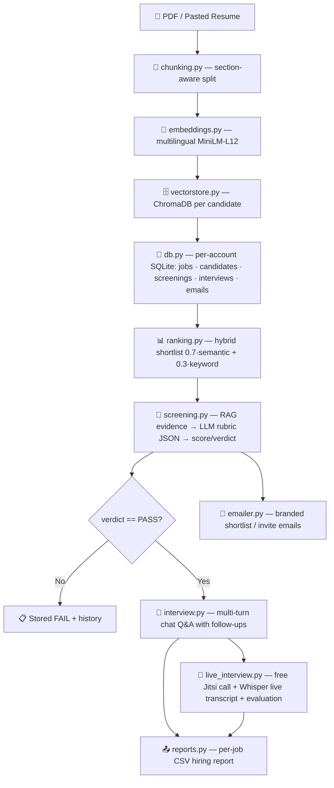

# 🧭 TalentIQ — Complete Project Manual

**Smart AI Recruiter System (RAG Edition) · Phase 2 — Mini-ATS**

This manual is the single source of truth for the project: what every file does, how
the AI pipeline works, how a recruiter uses the app, and how a developer extends it.

---

## Table of Contents

1. [Overview](#1-overview)
2. [System Architecture](#2-system-architecture)
3. [Project Structure — Every File](#3-project-structure--every-file)
4. [Data Model (SQLite)](#4-data-model-sqlite)
5. [The AI Pipeline, Step by Step](#5-the-ai-pipeline-step-by-step)
6. [User Manual — End-to-End Flow](#6-user-manual--end-to-end-flow)
7. [Developer Guide — Module Reference](#7-developer-guide--module-reference)
8. [UI, Theme & Styling Guide](#8-ui-theme--styling-guide)
9. [Configuration & Deployment](#9-configuration--deployment)
10. [Troubleshooting & Known Quirks](#10-troubleshooting--known-quirks)
11. [Roadmap (Phase 3)](#11-roadmap-phase-3)
12. [Visual Walkthrough — Screenshots](#12-visual-walkthrough--screenshots)

---

## 1. Overview

TalentIQ is an end-to-end recruitment automation platform built in Python with:

| Layer | Technology |
| :--- | :--- |
| UI | **Gradio 6** (custom theme + CSS) |
| Auth | **Multi-account** — email + password and optional **Google sign-in** (`users.db`) |
| Persistence | **SQLite**, one `recruiter.db` **per account** |
| Vector search | **ChromaDB** (`chroma_db/`) |
| Embeddings | **Sentence-Transformers** `paraphrase-multilingual-MiniLM-L12-v2` (local, CPU, 50+ languages) |
| Reranking | **Cross-Encoder** `cross-encoder/mmarco-mMiniLMv2-L12-H384-v1` (optional) |
| LLM | **Groq** `llama-3.3-70b-versatile` (+ fast `llama-3.1-8b-instant` for low-stakes calls) with **Ollama** local fallback |
| Email | **Your own SMTP** per account — branded shortlist & interview-invite emails |

It implements a complete hiring workflow: create requisitions → ingest resumes per job →
hybrid semantic+keyword ranking → LLM rubric deep-screening → multi-turn chat interviews
**and live meeting interviews** (free Jitsi + live transcription) → per-job CSV hiring
reports — plus **branded email outreach** (shortlist notifications, interview invites,
reusable templates, company logo).

**Design invariants (enforced throughout):**

- **Candidates are job-specific.** There is no global candidate pool — every candidate
  is owned by exactly one job listing and appears only in that job's pipeline, shortlist,
  and reports.
- **Raw internal IDs are never shown in the UI.** Jobs show a human **Req. ID**
  (e.g. `REQ-1001`); tables show names, scores, and timestamps only.
- **Sample data never pollutes real data.** Sample JDs only fill the *create-job form*;
  nothing is seeded into the job list automatically.
- **Accounts are isolated.** Each account signs in to its own database, Chroma index,
  exports, media and email settings — no shared candidate data.
- **Local-first for resumes.** No resume leaves the machine except the LLM API call
  (Groq), which receives only the retrieved evidence + rubric prompt. (Live-interview
  audio is streamed to Groq's hosted Whisper `whisper-large-v3` for transcription —
  see §5.5.)

---

## 2. System Architecture



Data flows **left to right**, and every stage persists to SQLite so the UI's History tab
and CSV export can reconstruct the whole journey of a candidate. `auth.py` sits in front
of the entire workspace: the login gate hides the UI and an API auth gate rejects any
Gradio event call without a valid session token.

---

## 3. Project Structure — Every File

```
AI_Recruiter/
├── app.py            # Entry point — launches the Gradio app (OAuth + API gate + backup)
├── ui.py             # The entire UI: layout, handlers, theme, custom CSS
├── auth.py           # Multi-account identity: users, sessions, Google OAuth, per-user scope
├── db.py             # SQLite persistence layer (all tables + queries, per-account)
├── config.py         # Central env-driven configuration (paths, models, limits)
├── emailer.py        # Branded HTML emails, template rendering, SMTP send
├── sample_data.py    # Sample JD templates (fill the create-job form only)
├── ranking.py        # Per-job hybrid shortlist (semantic + keyword + skill model)
├── screening.py      # RAG deep-screen: evidence → LLM rubric → verdict
├── interview.py      # Multi-turn chat interview session manager
├── live_interview.py # Live meeting interviews: Jitsi link + Whisper live transcription
├── video_interview.py# Recording persistence + Q&A parsing helpers for live interviews
├── rubric.py         # Weighted rubric math, labels, prompts, badges
├── llm.py            # Unified LLM client (Groq fast/slow + Ollama fallback)
├── prompts.py        # All LLM prompts in one place (screening, eval, follow-ups, Q&A)
├── vectorstore.py    # ChromaDB wrapper (index + search + re-index on model change)
├── embeddings.py     # Local sentence-transformer wrapper
├── chunking.py       # Section-aware resume chunking + JD requirement split
├── rerank.py         # Optional cross-encoder reranker
├── skill_model.py    # Optional fine-tuned BERT skill classifier (fallback keyword credit)
├── eval_retrieval.py # Offline RAG evaluation harness (recall@k / MRR / NDCG)
├── backup.py         # Hugging Face Spaces data survival (tar → private dataset repo)
├── pdf.py            # PDF → text extraction
├── reports.py        # Per-job CSV export
├── requirements.txt  # Python dependencies
├── MANUAL.md         # This document
├── README.md         # Quick-start + badges
├── docs/screenshots/ # Screenshots used by §12 (visual walkthrough)
├── users.db          # Global identity store (generated)
├── recruiter.db      # Global/fallback SQLite database (generated)
├── exports/          # Generated CSV reports (regenerable)
├── chroma_db/        # ChromaDB vector persistence (generated)
├── media/            # Live-interview recordings (generated)
└── data/users/       # Per-account: own recruiter.db, chroma, exports, media, logos (generated)
```

### File-by-file summary

| File | Role | Key exports |
| :--- | :--- | :--- |
| `app.py` | Entry point. Restores HF backup, inits DBs, preloads the embedding model, auto-picks a free port, then launches; registers Google OAuth routes and installs the **API auth gate**; starts the backup timer. | `install_api_auth_gate`, `find_free_port`, `register_google_oauth_routes` |
| `ui.py` | Everything the user sees: the login/register gate, 6 tabs (Jobs · Talent pool · Shortlist · Email · Interview · History & export), dozens of event handlers, the Gradio theme, and a large custom CSS block. Builds the app once (`demo = build_demo()`). | `build_demo()`, `demo`, `custom_css`, handler functions |
| `auth.py` | Multi-account identity: `users.db` (users + sessions), PBKDF2 password hashing, Google OAuth (PKCE), brute-force lockout, and `user_scope()` per-request thread isolation to each account's storage. | `init_db`, `register_user`, `authenticate`, `get_or_create_google_user`, `create_session`, `user_scope`, `set_active_user` |
| `db.py` | All SQLite access: schema init + migrations, jobs, candidates, job_candidates links, shortlists, screenings, interviews, video interviews, email settings + templates, audit log. Paths are per-account via the thread-local DB. | `init_db`, `create_job`, `upsert_candidate`, `save_screening`, `create_interview`, `save_video_interview`, `save_email_settings`, `save_email_template`, `ensure_default_email_templates`, `jobs_table_rows`, … |
| `config.py` | Single source of truth for env-driven paths and model/limit settings. | `DB_PATH`, `USER_DATA_DIR`, `EMBEDDING_MODEL`, `GROQ_MODEL`, `SQLITE_WAL`, … |
| `emailer.py` | Renders the branded email shell (company name + inline logo), fills template placeholders, and sends over the account's SMTP. | `resolved_settings`, `render_template`, `build_shortlist_email`, `build_invite_email`, `build_test_email`, `send_email` |
| `sample_data.py` | 3 sample JD titles + descriptions used to pre-fill the create form. No candidates. | `SAMPLE_JOB_DESCRIPTIONS` |
| `ranking.py` | Ranks one job's candidates with hybrid retrieval (no LLM). Persists shortlist snapshots; links ranked candidates to the job pipeline. Uses the fine-tuned skill model for category-aware keyword credit. | `ingest_candidate`, `rank_candidates_for_job`, `rank_and_save_shortlist`, `rank_jobs_batch`, `load_shortlist_results`, `format_ranking_*` |
| `screening.py` | Retrieves per-requirement evidence from Chroma, asks the LLM for a weighted rubric, computes score/verdict, persists the screening row. Also evaluates interview answers and generates interview questions. | `ScreeningResult`, `screen_candidate`, `deep_screen_candidate`, `suggest_interview_questions`, `evaluate_answers`, `format_screening_markdown` |
| `interview.py` | Chat-interview session dataclass + start/answer/submit logic, follow-up detection, auto-screening on start, evaluation at the end. Language-aware (English / German). | `InterviewSession`, `start_interview`, `submit_answer` |
| `live_interview.py` | Live meeting interviews: generates **free Jitsi** meeting links, streams browser-microphone audio, Whisper-transcribes every ~10s, separates speakers, and evaluates at the end. Sessions live in memory (2 h TTL); results persist to `video_interviews`. | `generate_meeting_link`, `start_live_session`, `append_audio_chunk`, `stop_live_session`, `finish_live_interview` |
| `video_interview.py` | Helpers for saving live recordings to disk (WAV) and parsing/evaluating Q&A from transcripts. | `save_live_recording`, `parse_qa_pairs`, `format_qa_markdown` |
| `rubric.py` | The weighted dimensions, PASS/FAIL rules, and markdown/badge rendering. | `RUBRIC_WEIGHTS`, `compute_weighted_score`, `apply_verdict`, `verdict_badge`, `rubric_prompt_block` |
| `llm.py` | Unified chat client: Groq (primary, slow + fast models) → Ollama (fallback). JSON mode + fence-stripping + retry/backoff. | `LLMClient`, `get_llm_client` |
| `prompts.py` | All LLM prompts centralized: screening rubric, answer evaluation, follow-up detection, Q&A parsing, question suggestion. | `build_screening_user_prompt`, `build_evaluation_user_prompt`, `build_followup_user_prompt`, `build_qa_parse_prompt`, `build_suggest_questions_prompt` |
| `vectorstore.py` | ChromaDB collection per resume; index/clear/search with cosine similarity; auto-rebuilds vectors when the embedding model changes. | `index_resume`, `search_resume`, `clear_candidate`, `maybe_reindex_all` |
| `embeddings.py` | Lazy-loaded multilingual MiniLM (384-dim). | `embed_texts`, `embedding_dimension` |
| `chunking.py` | Splits resumes by sections (Experience, Skills, Education…) with sliding windows; splits JDs into requirement chunks. | `chunk_resume`, `split_jd_requirements` |
| `rerank.py` | Optional cross-encoder rerank of top hits. | `rerank`, `rerank_enabled` |
| `skill_model.py` | Optional tiny BERT fine-tuned on labeled skill phrases; when present, ranking gives category credit (e.g. JD "Amazon Web Services" ↔ resume "AWS"). Train with `python skill_model.py`. | `train`, `load`, `classify_tokens` |
| `eval_retrieval.py` | CLI harness measuring retrieval quality (recall@k, MRR, NDCG) **with and without** the reranker over a labeled dataset. | `run_eval`, `main` |
| `backup.py` | HF Spaces data survival: tars users.db + per-user data into a private dataset repo on a timer; restores on boot when the local disk is empty. No-op unless `HF_TOKEN` + `HF_BACKUP_REPO` are set. | `push_backup`, `restore_if_needed`, `start_backup_timer` |
| `pdf.py` | Extracts text from uploaded PDFs (pypdf). | `extract_pdf_text` |
| `reports.py` | Per-job CSV report with the full pipeline columns. | `export_job_csv` |

---

## 4. Data Model (SQLite)

Each account owns a private `recruiter.db` (schema below, created by `db.init_db()` with
automatic in-place migrations for older databases). A shared `users.db` (`auth.py`) holds
accounts and sessions.

| Table | Purpose | Notable columns |
| :--- | :--- | :--- |
| `jobs` | Job requisitions | `id`, `req_id` (REQ-1001…), `title`, `description`, `requirements_json`, `created_at` |
| `candidates` | Resume records | `id` (stable hash of resume), `job_id` (owner listing), `name`, `resume_text`, `source` (pdf/paste/upload), `created_at` |
| `job_candidates` | Link table: candidate ↔ job pipeline with status | `job_id`, `candidate_id`, `status` (shortlisted…), `notes` |
| `shortlists` | Saved ranked snapshots per job | `job_id`, `results_json` (list of `RankResult`), `top_n`, `created_at` |
| `screenings` | Deep-screen results | `job_id`, `candidate_id`, `score`, `verdict`, `rubric_json`, `report_json`, `summary` |
| `interviews` | Chat interview sessions | `job_id`, `candidate_id`, `screening_id`, `questions_json`, `messages_json`, `answers_json`, `status`, `average_score`, `verdict`, `eval_json` |
| `video_interviews` | Live meeting interviews (and any recording analysis) | `job_id`, `candidate_id`, `video_path`, `transcript`, `qa_json`, `eval_json`, `average_score`, `verdict` |
| `email_settings` | Per-account SMTP sender + branding (single row) | `host`, `port` (default 587), `mail_from`, `mail_from_name`, `user`, `password` (encrypted at rest), `starttls`, `company_name`, `company_logo` |
| `email_templates` | Reusable message templates | `kind` (`shortlist`/`invite`), `name`, `subject`, `body`, `is_default` (≤1 preferred per kind) |
| `audit_log` | Append-only action log | `action`, `entity_type`, `entity_id`, `detail` |

**Key semantics:**

- **Candidate ownership** — `candidates.job_id` is the single owner. `add_candidate_to_job`
  "moves" a candidate to a job (clears other job links, sets `job_id`). This is what makes
  "each candidate belongs to exactly one job listing" true.
- **Deleting a job** (`delete_job`) also deletes its candidates, links, shortlists,
  screenings, chat interviews, and video interviews — a full cascade.
- **Stable candidate IDs** — `screening.stable_candidate_id(resume_text)` hashes the resume,
  so re-ingesting the same resume updates the same candidate instead of duplicating it.
- **Req. IDs** — auto-generated `REQ-1001`, `REQ-1002`, … (`_next_req_id`), or a custom ID
  typed by the recruiter (validated for uniqueness).
- **Email password at rest** — the SMTP password is encrypted in the DB with a key derived
  from the account's password hash (`auth.py`); a leaked DB file alone can't recover it.
- **Email templates** — each `kind` (shortlist/invite) may hold any number of templates;
  at most one is the **preferred** (`is_default=1`) one, pre-selected when composing.
  Starter templates are seeded per account the first time a kind has none.

---

## 5. The AI Pipeline, Step by Step

### 5.1 Ingest (`ranking.ingest_candidate`)

1. Resume text (from PDF or paste) → stable candidate ID (hash).
2. `chunking.chunk_resume` splits text into section-aware chunks (Experience, Skills,
   Education, Projects…), with a sliding window so nothing is lost between sections.
3. `vectorstore.index_resume` embeds each chunk (local model) and stores it in ChromaDB
   under the candidate ID.
4. `db.upsert_candidate` saves the raw text to SQLite.
5. The candidate is immediately linked to its owning job's pipeline
   (`add_candidate_to_job`, status `shortlisted`).

### 5.2 Ranking (`ranking.rank_candidates_for_job`)

No LLM — fast and free.

- JD → requirements via `split_jd_requirements`.
- For each of the job's candidates:
  - **Semantic score (0–100):** for every requirement, retrieve top-2 chunks from the
    candidate's Chroma collection and take the best cosine similarity. Average across
    requirements; blend 60/40 with a global JD similarity.
  - **Keyword score (0–100):** token-overlap ratio between each requirement and the raw
    resume (stop-words filtered). When literal overlap is zero and the fine-tuned skill
    model is available, category-aware credit is applied (e.g. JD says "Amazon Web
    Services", resume says "AWS").
  - **Hybrid = 0.7 × semantic + 0.3 × keyword.**
- Sort descending, truncate to `top_n`, persist the shortlist snapshot, and link ranked
  candidates to the job pipeline.

### 5.3 Deep Screening (`screening.screen_candidate` / `deep_screen_candidate`)

1. For each JD requirement, retrieve the top-3 most relevant resume chunks
   (reranker enabled by default) → builds an *evidence block* per requirement.
2. The LLM (Groq or Ollama) receives the evidence and is asked to score four weighted
   dimensions on 0–10 with quoted evidence, returning strict JSON:
   - must_have_skills (40%) · experience (25%) · projects (20%) · education_extras (15%)
3. `rubric.compute_weighted_score` → overall /100.
4. **PASS requires overall ≥ 55 AND must-have skills ≥ 4/10** (`apply_verdict`).
5. The result (score, verdict, rubric, evidence, interview focus) is persisted.

### 5.4 Chat Interview (`interview.start_interview` / `submit_answer`)

- Starting an interview auto-screens the candidate if they aren't PASS yet (one LLM call).
  Explicit FAIL candidates are blocked.
- The AI **suggests exactly 10 tailored questions** (JD + resume + screening focus) via
  `screening.suggest_interview_questions`; a rule-based fallback is used if the LLM is
  unreachable. Questions, follow-ups, and feedback follow the selected language
  (English or German).
- Each answer: the LLM decides whether a short follow-up is warranted (vague/short
  answers get one follow-up per core question).
- After all questions, `evaluate_answers` scores the transcript and produces a verdict
  + per-question feedback, persisted to the `interviews` table.

### 5.5 Live Meeting Interview (`live_interview`)

1. Generate a **free Jitsi meeting link** (`generate_meeting_link`) — no account, no
   time limit; paste it into Email → Interview invite.
2. During the call, stream the browser microphone: audio chunks are sent to **Groq's
   hosted Whisper** (`whisper-large-v3`) every ~10 s for transcription (requires
   `GROQ_API_KEY`), and the AI separates interviewer vs. candidate turns.
3. **Stop & transcribe remainder**, then **review & fix the transcript** before evaluating
   (correct any words Whisper misheard).
4. **Finish & evaluate** scores the speaker-separated Q&A and persists the result
   (transcript, Q&A pairs, eval, average score, verdict) to the `video_interviews` table.
   Live sessions expire from memory after 2 hours.

### 5.6 Email (`emailer`)

1. The account configures its own SMTP sender in **Email → ⚙️ Email settings**
   (host, port 587, from-address, username/password, STARTTLS) plus **company branding**
   (name + logo) — saved per account, testable with a branded test email.
2. Composing a **Shortlist notification** or **Interview invite** auto-selects the
   account's preferred template for that type (or the built-in design).
3. `render_template` fills placeholders per candidate — `{{name}}`, `{{job_title}}`,
   `{{req_id}}`, `{{message}}`, `{{invite_link}}` — all values HTML-escaped
   (a template can never inject markup). `{{invite_link}}` becomes a "Join the
   interview" button for http(s) links.
4. `send_email` delivers the branded HTML (company name + logo header, teal shell) over
   the account's SMTP. If SMTP isn't configured the app keeps working and shows a clear
   banner instead of failing.

### 5.7 Export (`reports.export_job_csv`)

One CSV per job with columns: rank, candidate_id, name, hybrid/semantic/keyword scores,
screening score+verdict+summary, interview status+avg+verdict. UTF-8 with BOM for Excel.

---

## 6. User Manual — End-to-End Flow

Launch: `python app.py` → open the printed URL (default `http://127.0.0.1:7861`; the app
auto-picks the next free port if that one is busy).

### Step 0 — Sign in

The app opens on a **login gate**. **Create account** (email + password), or sign in with
**Google** when `GOOGLE_CLIENT_ID`/`GOOGLE_CLIENT_SECRET` are configured. Each account has
its own private data — jobs, candidates, emails, settings. Sessions last 30 days;
**Sign out** returns to the gate. Failed attempts trigger a temporary lockout.

### Tab 1 — Jobs

1. **Open a requisition**: type a title + paste the JD, or pick a **sample JD** (it only
   fills the form — nothing is auto-added to your lists). Optionally type a custom
   **Req. ID**; leave blank for auto-generation.
2. Click **Create job** → it appears in the **Open roles** table with Req. ID, candidate /
   shortlist / screened counts, and creation date.
3. **Focus job** dropdown drives the rest of the workspace.
4. **Delete a job listing**: pick a job from the dropdown → **Delete selected listing**
   (red button) removes the job *and everything tied to it* — candidates, shortlists,
   screenings, interviews.
5. **Candidate pipeline** for the focus job: tick **Select** boxes → **Remove selected
   from this job** (detaches them) or **Delete selected entirely** (permanent).

### Tab 2 — Talent pool

1. Pick the **Job listing** first — candidates ingested now belong to *that job only*.
2. **Ingest PDFs** (batch) or paste **Resume text** (+ optional name override) → ingest.
3. Edit/remove candidates via the dropdown + editor. The table shows only that job's
   candidates (Name · Source · Created — no raw IDs).

### Tab 3 — Shortlist

1. **Rank selected jobs**: pick one or more jobs (multi-select) → **Rank selected jobs**
   builds an independent ranked shortlist per job (hybrid scores).
2. **Focus job shortlist & deep screen**: pick a job + candidate; **Deep-screen selected**
   runs the LLM rubric and shows a full evidence-backed report (score, verdict badges,
   per-dimension scores, gaps, interview focus).
3. **Deep-screen top N** batch-screens the top N.
4. **Top N for interview** (1–20) controls how many shortlisted candidates flow to the
   Interview tab; the Interview list syncs live.

### Tab 4 — Email

**Shortlist notifications & interview invites** — sent over *your own SMTP* (per account,
configured in ⚙️ Email settings). Until SMTP is configured the app shows a warning banner;
everything else keeps working.

1. Pick a **Job** + **Candidate** — the **Recipient email** auto-fills from the resume
   (editable).
2. Choose the **Email type**: `Shortlist notification` or `Interview invite`.
3. The **Email template** dropdown pre-selects your *preferred* template for that type
   (or the built-in design). Add an **Optional personal message**; for invites, paste the
   **Interview invite link** (e.g. the Jitsi link from the Interview tab) — it renders as
   a button inside the email.
4. **Send email** → the branded message goes out and appears in **Recently sent emails**.

**📝 Email templates** — create/edit multiple reusable templates *per email type*:

- Pick a template to edit, or **✨ New template**; name it, write the **subject** and
  **body** using placeholders: `{{name}}`, `{{job_title}}`, `{{req_id}}`, `{{message}}`,
  and (for invites) `{{invite_link}}`. Blank lines become paragraph breaks.
- **💾 Save template** persists it; **⭐ Set as preferred** makes it the auto-selected
  template for that email type; **🗑 Delete template** removes it (emails fall back to
  the built-in design).
- Starter templates ("Standard shortlist", "Standard interview invite") are seeded
  automatically when a type has none.

**⚙️ Email settings** (per account):

- **SMTP host** (with quick presets), **port** (defaults to 587), **From address** +
  **From name**, **username/password**, **STARTTLS**. For Gmail, use an **App Password**.
- **Company name** + **Company logo** (PNG/JPG/GIF/WebP, ≤ 2 MB) — shown at the top of
  every outgoing email.
- **Save settings** stores everything; **Send test email** *saves the form first, then
  sends* a branded test email to the recipient you type. **Clear settings** wipes the
  SMTP config but keeps your branding.

> 📸 See **§12.2** for a step-by-step visual walkthrough of the Email tab.

### Tab 5 — Interview

1. Choose **Job** + **Candidate** (pre-filled from the top-N shortlist with
   PASS/FAIL/not-screened badges; non-PASS candidates auto-screen on start). Pick the
   **Interview language** (English/German).
2. **Chat interview** (default): **Start chat interview** → the AI suggests **10 tailored
   questions** and asks Q1. Type each answer → **Send** (or Enter); thin answers get one
   follow-up each. After the last question, a full evaluation (per-question + overall
   verdict) is shown and saved.
3. **Live meeting interview**: choose the mode, then
   - **Generate free Jitsi meeting link** → a Jitsi room opens directly; copy the link to
     Email → Interview invite.
   - **Show AI-suggested questions** to prep the call.
   - **▶ Start live transcription**, press **record** on the microphone — Whisper
     transcribes every ~10 s with speaker separation.
   - **⏹ Stop & transcribe remainder**, **review & fix the transcript**, then
     **✅ Finish & evaluate** to score the answers. Results appear in **Live interview
     history (this job)**.

> 📸 See **§12.3** for a step-by-step visual walkthrough of the live interview flow.

### Tab 6 — History & export

1. **Filter by job** → screening + chat-interview history tables with PASS/FAIL badges
   (email history lives in the Email tab, live-interview history in the Interview tab).
2. **Generate CSV report** (per selected job) → **Download CSV**. The file lands in
   `exports/` and is Excel-ready.

---

## 7. Developer Guide — Module Reference

### `app.py` — boot sequence
```python
backup.restore_if_needed()      # restore accounts/data from the HF dataset repo (no-op unless configured)
auth.init_db()                  # users.db — the identity store
db.init_db()                    # global/fallback recruiter.db
vectorstore.maybe_reindex_all() # rebuild vectors if the embedding model changed
# ... preload the embedding model on a daemon thread, find a free port, launch ...
register_google_oauth_routes()  # /auth/google/start on the RUNNING app (after launch)
install_api_auth_gate()         # every Gradio API call requires a valid session token
backup.start_backup_timer()     # periodic HF backup (no-op when not configured)
```
Port logic: `PORT` env (default `7860` on Spaces, **`7861` locally**) — and
`find_free_port` skips busy ports automatically, so two instances can coexist.

The **API auth gate** (`_ApiAuthGate`) is a pure-ASGI middleware spliced in front of the
live app: it rejects `/gradio_api/call/*` and `/gradio_api/queue/join` POSTs with 401
unless the payload carries a valid session token — except the auth events themselves
(`_on_auth_mode`, `_on_auth_submit`, `_on_logout`, `_on_page_load`).

### `ui.py` — the wiring hub
- **Login gate** (`build_app`): sign-in / create-account / Google flows, session restore
  on page load, lockout handling. The workspace is hidden until a valid session exists.
- **Module-level helpers** (`_job_choices`, `_candidate_choices`, `_interview_choices`,
  `_candidates_table`, `_jobs_table`, `_stats_markdown`, `_email_template_choices`,
  `_email_settings_values`, `_video_history_table`, …) turn DB rows into Gradio
  choices/values. No raw IDs ever reach the UI.
- **`refresh_workspace(job_id)`** is the master refresh: it returns **17 outputs**
  (all shared dropdowns, tables, status markdown, KPIs). Keep the count in sync with
  `_ws_outputs` in `build_demo()`.
- **Handlers** (`on_create_job`, `on_delete_job`, `on_add_resume_text`, `on_upload_pdfs`,
  `on_rank_multi`, `on_deep_screen`, `on_start_interview`, `on_chat_submit`,
  `on_send_email`, `on_save_email_template`, `on_save_email_settings`,
  `on_live_*`, `on_export_csv`, …) — every one returns a tuple matching its `outputs=`
  list exactly.
- **`_JC_ACTION_OUTPUTS = [*_ws_outputs, em_cand_dd, vi_history]`** — the workspace
  outputs refreshed by the pipeline action buttons (17 + the email candidate dropdown
  + live-interview history). Add outputs to `_ws_outputs` only with care: the auth sweep
  asserts `len(_auth_outputs) == _AUTH_REFRESH_OUTPUTS` (currently **40** = 17 workspace
  + 11 email-settings + 6 template + 2 histories + 4 profile).
- **`custom_css`** — the full design system (see §8).
- **`build_demo()`** — constructs the Blocks, wires every event, returns `demo`.
  `demo = build_demo()` runs at import time so `app.py` just launches it.

> ⚠️ **Counting rule of thumb:** after changing any handler's return values, run the app —
> Gradio raises at startup if `outputs=` count ≠ returned tuple length.

### `auth.py` — identity & isolation
- `users.db` holds users (PBKDF2-hashed passwords or Google sub) + sessions
  (30-day TTL, pruned lazily) + auth-attempt counters (per-email and per-IP lockouts).
- **`user_scope(token)`** is the isolation primitive: it validates the session and, for
  the duration of the block, points the thread-local `db`, `vectorstore`, `reports` and
  `video_interview` modules at that account's private storage
  (`data/users/<user_id>/…`). Every workspace handler runs inside it.
- Google sign-in: PKCE authorization-code flow; `new_google_attempt`/callback handlers in
  `ui.py` + OAuth routes in `app.py`. Clock-skew tolerance via `GOOGLE_CLOCK_SKEW_SECONDS`.

### `db.py`
Everything SQLite. Use the context manager pattern:
```python
with db.connect() as conn:      # rows are sqlite3.Row → dict via _row_to_dict
    ...
```
Migrations (`_migrate_job_req_id`, `_migrate_candidate_job_id`,
`_migrate_job_candidates`, `_migrate_email_branding`) run inside `init_db()` and are
idempotent — older databases are upgraded in place on next launch. The SMTP password is
encrypted at rest (`_encrypt_password` / `_decrypt_password`) with a per-account key.

### `emailer.py` — branded email
`resolved_settings()` merges the account's saved `email_settings` row (SMTP + branding);
until an account saves settings, sends stay disabled (no `.env` fallback for SMTP).
`render_template(body, context)` substitutes escaped placeholders; `{{invite_link}}` is
injected as a styled button after paragraphization (never nested inside a `<p>`).
`build_shortlist_email` / `build_invite_email` / `build_test_email` share the same
`_html_page` shell (company name + inline base64 logo header, teal card layout, plain-text
fallback for non-HTML clients).

### `llm.py`
`get_llm_client(api_key)` returns `(client, error)`. Priority: user/Groq key →
`GROQ_API_KEY` → Ollama (if reachable). **Hybrid routing:** `GROQ_MODEL` (strong) for
scoring, `GROQ_FAST_MODEL` (cheap) for low-stakes calls like follow-up detection and
question suggestion. `LLMClient.chat_json` handles JSON mode, strips ``` fences, and
retries with exponential backoff (`LLM_MAX_ATTEMPTS`, `LLM_BASE_DELAY`).

### `screening.py` / `rubric.py`
`ScreeningResult` carries score, verdict, summary, strengths/gaps/interview_focus,
evidence snippets. Rubric weights live in one place (`rubric.py`) so changing hiring
policy is a one-line edit (weights must sum to 1.0; `PASS_THRESHOLD`/`MUST_HAVE_MIN`).

### `interview.py` / `live_interview.py`
`InterviewSession` is a dataclass that serializes to/from dict (Gradio `gr.State`).
`submit_answer` mutates and returns the session — the UI re-serializes it into state.
Follow-up detection is fail-open (no LLM → heuristic for very short answers).
`live_interview` keeps `LiveSession`s in an in-memory registry (2 h TTL, stale sweep),
transcribes streamed audio chunks on a background thread, and writes results to the
`video_interviews` table on `finish_live_interview`.

### `vectorstore.py` / `embeddings.py` / `chunking.py` / `rerank.py` / `pdf.py` / `skill_model.py`
Infrastructure wrappers. `rerank_enabled()` checks the `RERANK_ENABLED` env var
(default on) so free-tier Spaces can disable the cross-encoder to save RAM/CPU.
`vectorstore.maybe_reindex_all()` rebuilds vectors on boot when `EMBEDDING_MODEL` changed.
`skill_model` is fail-open: without a trained model, ranking behaves exactly as before.

### `eval_retrieval.py` / `backup.py`
`eval_retrieval.py` is a dev/QA CLI (`python eval_retrieval.py [--no-rerank] [--k N]`)
that reports recall@k / MRR / NDCG over a small labeled dataset, mirroring production's
fetch-then-rerank pool. `backup.py` is a silent no-op unless `HF_TOKEN` + `HF_BACKUP_REPO`
are set: it tars `users.db` + per-user data into a **private** dataset repo on a timer and
restores them on boot when the local disk is empty (free Spaces have ephemeral disks).

### `reports.py`
`export_job_csv` writes to `exports/` with a slugified filename
(`hiring_report_<job-slug>_<timestamp>.csv`). Reads rank, screenings, and interviews to
build one row per candidate.

---

## 8. UI, Theme & Styling Guide

### Theme (`_theme()` in `ui.py`)
`gr.themes.Soft` with a custom **teal** primary palette (c50→c950), slate neutrals, and
DM Sans. Core colors are mirrored as CSS variables in `custom_css` (`:root`):

| Token | Value | Use |
| :--- | :--- | :--- |
| `--brand` / `--brand-dark` | `#0f766e` / `#115e59` | primary buttons, focus rings, active nav pill |
| `--danger` / `--danger-dark` | `#dc2626` / `#b91c1c` | delete / destructive buttons |
| `--ink` / `--ink-soft` / `--muted` | `#0f172a` / `#1e293b` / `#475569` | text hierarchy |
| `--surface` / `--line` / `--wash` | `#ffffff` / `#e2e8f0` / `#f0fdfa` | panels, borders, tinted chips |
| `--pass-*` / `--fail-*` | green / red | verdict badges |

### Button system — one consistent scheme
Every button shares the same shape (10px radius, 38px min-height, weight 600) and differs
only by *semantic* color:

- **`primary`** (solid teal) — the main action of each panel: Create job, Ingest PDFs,
  Save changes, Rank selected jobs, Deep-screen selected, Sync top N, Start chat
  interview, Send (chat), Send email, 💾 Save template, Save settings, ▶ Start live
  transcription, ✅ Finish & evaluate, Generate CSV report.
- **`secondary`** (white + hairline border) — supporting actions: Load/refresh,
  Load into editor, Deep-screen top N, Remove selected from this job, Refresh, ⚙️ Email
  settings, ✨ New template, ⭐ Set as preferred, Generate free Jitsi meeting link,
  Show AI-suggested questions, ⏹ Stop & transcribe remainder, Send test email.
- **`stop`** (solid red) — destructive only: Delete selected listing, Delete selected
  entirely, Remove (candidate), 🗑 Delete template.

All variants have hover lift (`translateY(-1px)`) + soft shadow, and an active press
scale. The **nav pills** reuse the brand teal for the selected tab.

### Dropdown styling (Gradio 6 specifics)
Gradio 6 renders a dropdown as `.container > .wrap > .wrap-inner` (the closed box). When
opened, the **same `.wrap`** becomes the popup backdrop around `ul.options`. In dark mode
that backdrop is solid slate — which read as a "dark navy box" around the list. The CSS
pins it white, rounds it, adds the shadow, hides the built-in `✓` span
(`.container .options .inner-item { display: none }`), tints the selected row with
`--wash`, and gives the focused box a teal ring via `.container:focus-within > .wrap`.

> ⚠️ **Gradio 6 removed `gr.Popover`** — the ⚙️ Email settings "bubble" is an
> absolutely-positioned panel toggled with a visibility flag (`.email-settings-pop`),
> reproducing the popover UX.

### Tables
- `th`/`td` are `white-space: nowrap`; each `gr.Dataframe` declares explicit
  `column_widths=` so headers like "Candidates"/"Shortlist" never wrap into
  "Can/dida/tes".
- `.table-wrap { overflow-x: auto }` — narrow screens scroll horizontally instead of
  squashing.

### Responsive breakpoints
`1100px` (container goes full-width), `900px` (panels stack, nav pills flex), `640px`
(forms go full-width, rows wrap, KPI grid → 2 columns, smaller fonts, shorter chatbot),
`480px` (tighter padding).

> ⚠️ **Critical Gradio quirk (why the mobile CSS broke once):** Gradio *prefixes* every
> custom-CSS rule with `.gradio-container.gradio-container-<ver> .contain`, and for rules
> inside `@media` blocks it keeps **only the prefixed copy**. Therefore media-query
> selectors must **not start with `.gradio-container` or `.contain`** (they'd be double-
> prefixed and never match). Prefer bare selectors (`.row`, `.form`, `.app-row`).
> The container itself is fluid via the base rule `width:100%; max-width:1180px`.

### Dark-mode handling
Gradio inherits the OS dark-mode preference and tags `<body class="dark">`, which flips
surfaces to dark navy. The CSS pins every theme surface to light values inside
`.gradio-container` (see the "Force light surfaces" block) so the app is always light
with readable text.

---

## 9. Configuration & Deployment

### Local
```powershell
.venv\Scripts\activate
pip install -r requirements.txt
create .env with GROQ_API_KEY="gsk_..."
python app.py        # → http://127.0.0.1:7861 (auto-picks next free port if busy)
```

### Environment variables

| Variable | Default | Effect |
| :--- | :--- | :--- |
| `PORT` | `7860` (Spaces) / `7861` (local) | Bind port (auto-increments if busy) |
| `GRADIO_SERVER_NAME` | `0.0.0.0` (Spaces) / `127.0.0.1` | Bind address |
| `GRADIO_SHARE` | `0` | `1` creates a temporary public share link |
| `RECRUITER_DB_PATH` | `recruiter.db` | Global/fallback SQLite path |
| `USERS_DB_PATH` | `users.db` | Identity store (accounts + sessions) |
| `USER_DATA_DIR` | `data/users` | Per-account data root |
| `CHROMA_DIR` | `chroma_db` | Vector store directory |
| `EXPORT_DIR` | `exports` | CSV export directory |
| `MEDIA_DIR` | `media` | Live-interview recordings |
| `GOOGLE_CLIENT_ID` / `GOOGLE_CLIENT_SECRET` | — | Enable Google sign-in (button hidden when empty) |
| `GOOGLE_CLOCK_SKEW_SECONDS` | `60` | Google id_token `iat`/`exp` tolerance |
| `EMBEDDING_MODEL` | `paraphrase-multilingual-MiniLM-L12-v2` | Local embedding model (change → vectors auto-rebuild) |
| `RERANK_MODEL` | `cross-encoder/mmarco-mMiniLMv2-L12-H384-v1` | Cross-encoder reranker |
| `RERANK_ENABLED` | `1` | `0` disables the cross-encoder (saves ~80 MB RAM/CPU) |
| `SKILL_MODEL_DIR` | `data/skill_model` | Fine-tuned skill classifier artifacts |
| `SKILL_CLASSIFIER_ENABLED` | `1` | `0` disables the skill classifier |
| `GROQ_API_KEY` | — | LLM provider (fallback: local Ollama) |
| `GROQ_MODEL` | `llama-3.3-70b-versatile` | Strong model (scoring, screening) |
| `GROQ_FAST_MODEL` | `llama-3.1-8b-instant` | Cheap model (follow-ups, question suggestions) |
| `OLLAMA_MODEL` | `llama3.1:8b` | Ollama fallback model |
| `LLM_MAX_ATTEMPTS` / `LLM_BASE_DELAY` | `4` / `1.0` | Retry/backoff for LLM calls |
| `AUTH_MAX_FAILED_ATTEMPTS` | `5` | Failed logins per email before lockout |
| `AUTH_IP_MAX_FAILED_ATTEMPTS` | `20` | Failed logins per IP before lockout |
| `AUTH_LOCKOUT_WINDOW` | `900` | Lockout window (seconds) |
| `AUTH_MAX_REGISTRATIONS_PER_IP` / `AUTH_REGISTER_WINDOW` | `5` / `3600` | Registration rate cap per IP |
| `AUTH_ENFORCE_IP_LIMITS` | `1` (`0` on Spaces) | Per-IP caps (off on Spaces — shared proxy IP) |
| `SESSION_TTL_DAYS` | `30` | Persistent session lifetime |
| `MAX_PDF_UPLOAD_MB` | `15` | Reject PDFs above this size |
| `MAX_LOGO_MB` | `2` | Reject company logos above this size |
| `SQLITE_WAL` | `1` | WAL journal mode (`0` for cloud-synced drives like OneDrive) |
| `HF_TOKEN` | — | Token for the HF backup dataset repo |
| `HF_BACKUP_REPO` | — | e.g. `user/talentiq-backup` — enables periodic backup |
| `HF_BACKUP_INTERVAL_MIN` / `HF_BACKUP_FIRST_DELAY_MIN` | `30` / `2` | Backup cadence |
| `HF_BACKUP_INCLUDE_MEDIA` | `0` | `1` archives live-interview recordings too |
| `HF_BACKUP_ENABLED` | `1` | `0` disables the backup timer |

> **SMTP is NOT configured via `.env`** — each account configures its own SMTP sender
> (host, port, credentials, branding) in **Email → ⚙️ Email settings**; the app
> deliberately doesn't read SMTP from environment variables.

### Hugging Face Spaces
Create a Docker/Python Space, add `GROQ_API_KEY` as a **Secret**, push the repo.
`app.py` auto-adapts via `SPACE_ID` (port `7860`, `0.0.0.0`, per-IP auth limits off).
Free Spaces have **ephemeral disks** — set `HF_TOKEN` + `HF_BACKUP_REPO` (a **private**
dataset repo) so `backup.py` tars all accounts + data on a timer and restores them after
a rebuild. Without backup, data is wiped whenever the Space sleeps or rebuilds.

---

## 10. Troubleshooting & Known Quirks

| Symptom | Cause / Fix |
| :--- | :--- |
| "No LLM available" | Set `GROQ_API_KEY` in `.env` or start Ollama (`ollama serve`). |
| Slow first screen | The embedding model (~80 MB) loads lazily on first ingest/rank. |
| Tables empty / 0-height | An old CSS rule hid the "Drop CSV" button that wraps Dataframes — removed. Restart the server to pick up the current `ui.py`. |
| Dark navy dropdown box | OS dark mode + Gradio's `.wrap` backdrop — handled by the dropdown CSS block (§8). |
| My CSS media rules "don't work" | See the CSS-prefixing quirk in §8 — media selectors must not start with `.gradio-container`. |
| Duplicate candidates on re-ingest | Stable IDs hash the resume — same resume updates the same candidate. |
| Req. IDs look wrong | Custom IDs must be unique; auto IDs continue from the highest existing. |
| Port already in use | The app now auto-picks the next free port (`find_free_port`) — check the printed URL. To force one: `PORT=7861 python app.py`. |
| Two instances running | The preview (e.g. 7860) and your original (e.g. 7861) can run side-by-side; each account's data is isolated, and both share SQLite safely — but restart both after code changes. |
| "Your session has expired" / API 401s | Sessions last 30 days (`SESSION_TTL_DAYS`) and are per-account — sign in again. Restarting the server keeps sessions valid. |
| Google sign-in fails | `GOOGLE_CLIENT_ID`/`GOOGLE_CLIENT_SECRET` must be set and the redirect URI registered; a clock skew beyond `GOOGLE_CLOCK_SKEW_SECONDS` also fails ("Token used too early"). |
| Send test email fails | SMTP must be saved first (the test button saves the form before sending). For Gmail use an **App Password** (2FA required), port 587 + STARTTLS. |
| Emails show the default brand | Set **Company name** and upload a **logo** in Email → ⚙️ Email settings (PNG/JPG/GIF/WebP, ≤ 2 MB; SVG is rejected for security). |
| Live transcription never starts | The browser must allow **microphone** access, and a `GROQ_API_KEY` must be available (transcription uses Groq's hosted Whisper API). |
| Data disappeared on HF Spaces | Free Spaces have ephemeral disks — configure `HF_TOKEN` + `HF_BACKUP_REPO` so `backup.py` restores everything on boot. |
| Live sessions lost mid-call | Live sessions are in-memory with a 2 h TTL; finish the interview (✅ Finish & evaluate) before the tab/process closes to persist results. |

---

## 11. Roadmap (Phase 3)

See `README.md` for the product vision. Auth (multi-account + Google) and the retrieval
evaluation harness (`eval_retrieval.py`) shipped in Phase 2. Remaining ideas:

- **PII redaction** of resumes before LLM calls.
- **Roles & permissions** — today every account fully controls its own data; a workspace
  with team members (recruiter/hiring-manager/admin) would need shared jobs with scoped
  actions.
- **Docker packaging** — a Dockerfile that runs the app + Ollama together.
- **Calendar / scheduling integration** for interview invites, and richer email
  attachments.

The architecture is ready: all logic is already decoupled from the UI via
`db.py`/`ranking.py`/`screening.py`, so new layers can call them directly.

---

## 12. Visual Walkthrough — Screenshots

> Screenshots were captured from a live instance with a demo account, one job
> (REQ-1000 Senior LLM Engineer) and one candidate (Maya Chen). Your screens will
> match this whenever the workspace is populated. Images live in `docs/screenshots/`.

### 12.1 Signing in


The app opens on the **login gate**. Use **Sign in** with your email + password, or
switch to **Create account** for a new account (Google sign-in appears when configured).


Once signed in you land in the **Jobs** tab: KPI cards (open roles, candidates, deep
screens), the **Open a requisition** form, and the **Open roles** + **Candidate
pipeline** tables — all scoped to *your* account.

### 12.2 Email tab, step by step

**Step 1 — Open the Email tab and pick the recipient.**


Click the **Email** nav pill. Choose a **Job** + **Candidate** — the **Recipient email**
auto-fills from the resume (editable). Select the **Email type** (Shortlist notification
/ Interview invite); the **Email template** dropdown pre-selects your preferred template
for that type.

**Step 2 — Configure the SMTP sender + branding.**


Open **⚙️ Email settings** (top-right of the tab). Fill in your **SMTP host** (presets
included), **port** (587), **From address / name**, **username/password**, tick
**STARTTLS** — then add your **Company name** and upload a **Company logo** (shown in the
header of every email you send). Click **Save settings**. **Send test email** saves the
form first, then sends a branded test to the recipient you type.

**Step 3 — Edit or create templates.**


Scroll to **📝 Email templates**. Pick a template from the **Template** dropdown (the
preferred one is marked ★) to load it into the editor, or **✨ New template** to start
fresh. Use placeholders `{{name}}`, `{{job_title}}`, `{{req_id}}`, `{{message}}` and
(for invites) `{{invite_link}}`. **💾 Save template** persists it; **⭐ Set as preferred**
makes it the auto-selected template for that email type.

Then fill in the **Optional personal message** (and the **Interview invite link** for
invites) and click **Send email** — the branded message goes out and appears in
**Recently sent emails**.

### 12.3 Live meeting interview, step by step

**Step 1 — Switch the Interview tab to Live meeting mode.**


In the **Interview** tab pick the **Job** + **Candidate** and set **Interview mode** to
**Live meeting interview**. The live panel appears: a free Jitsi link generator,
AI-suggested questions, and the transcription controls.

**Step 2 — Generate the meeting link.**


Click **Generate free Jitsi meeting link** — a Jitsi room is created instantly (free, no
account, no time limit) and the link lands in the **Interview invite link** box. Copy it
into **Email → Interview invite** (or share it directly with the candidate).

**Step 3 — Run the call.**

- **▶ Start live transcription**, then press **record** on the microphone — the call's
transcript streams in as it's transcribed (Whisper, every ~10 s, speaker-separated).
- **⏹ Stop & transcribe remainder**, **review & fix the transcript**, then
  **✅ Finish & evaluate** — the AI scores the answers and the result appears in
  **Live interview history (this job)**.

---
