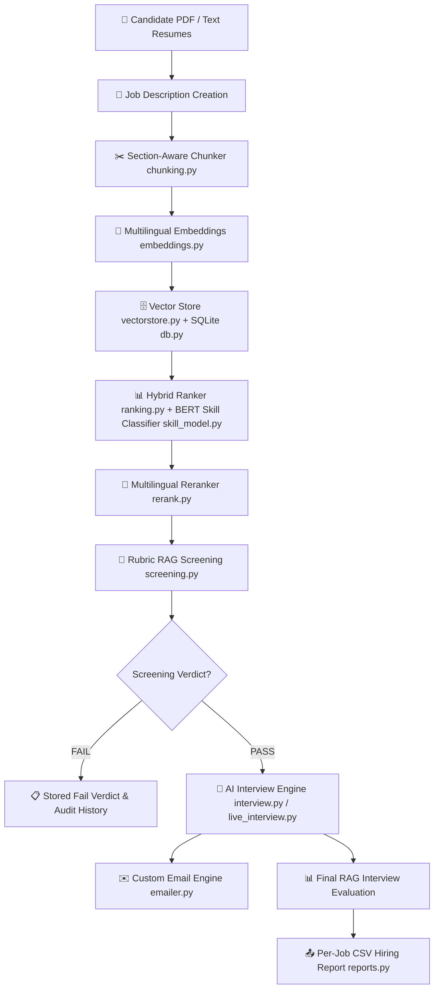

# 💼 Smart AI Recruiter System (TalentIQ)
### 🚀 Production-Grade RAG Mini-ATS: Multi-User Identity · Hybrid Corpus Ranking · Rubric Screening · Live AI Interviewing · Custom Email Engine


The **Smart AI Recruiter System (TalentIQ)** is a full-stack, production-grade recruitment automation platform and Mini-ATS. It combines **Retrieval-Augmented Generation (RAG)**, **hybrid dense/sparse vector search**, **fine-tuned transformer skill classification**, **multi-turn AI interview simulation**, **live meeting transcription**, and **per-account branded email automation**.

> 📘 **Full Manual & Architecture:** See **[`MANUAL.md`](MANUAL.md)** for exhaustive technical documentation, data models, API flows, and developer guides.

---

## 🌟 Key System Capabilities

### 🔐 1. Multi-User Identity & Account Isolation
- **Authentication**: Email/password authentication (PBKDF2 with SHA-256 + salt) and **Google OAuth 2.0 PKCE** redirect flow.
- **Session Management**: Persistent HTTP session tokens stored in browser cookies with 30-day automatic expiration (`users.db`).
- **Data Isolation**: Each user account gets a dedicated private data directory (`data/users/<user_id>/`) containing its own `recruiter.db` (SQLite), `chroma_db/` (vector store), `exports/` (CSV reports), and `logos/` (branding assets). No account can ever access another user's candidate pool or jobs.

### 💼 2. Job Requisition & Talent Pool Management
- **Job Requisitions**: Full job description management with unique requisition IDs (`REQ-xxxx`), required skills, experience levels, and custom evaluation criteria.
- **Resume Ingestion**: Ingest candidate resumes via PDF upload (`pypdf` extraction) or plain text.
- **Per-Job Isolation**: Resumes are linked strictly to specific job pipelines, preventing cross-job candidate pollution.

### 🧬 3. Hybrid Ranking & Fine-Tuned Skill Category Fallback
- **Hybrid Scoring**: Combines **70% semantic vector similarity** (Multilingual MiniLM-L12) + **30% keyword overlap**.
- **Cross-Encoder Reranking**: Reranks top hits using `mmarco-mMiniLMv2-L12-H384-v1` for high-precision retrieval across English and German.
- **Fine-Tuned BERT Skill Classifier**: Includes a custom-trained PyTorch BERT model (`skill_model.py`) that classifies skill phrases into 10 categories. When literal keyword overlap is zero (e.g., JD specifies "Amazon Web Services", candidate resume lists "AWS"), the system falls back to category-level matching.

### 🧠 4. RAG Rubric Screening
- **Evidence-Based Evaluation**: Retrieves relevant candidate resume chunks to score candidates against a weighted 4-dimension rubric:
  - **Must-have skills (40%)** — *Hard gate: must score ≥ 4/10 to pass*
  - **Relevant experience (25%)**
  - **Projects & impact (20%)**
  - **Education & extras (15%)**
- **Automated Verdict**: Computes an overall score (Pass threshold ≥ 55/100) and saves structured JSON evidence with strength/weakness bullet points.

### 🎤 5. AI-Powered Technical Interviewing (Chat & Live Meeting)
- **Multi-Turn Chat Interview**: Conducts multi-turn technical interviews grounded in job requirements and candidate resume evidence, supporting both **English and German**.
- **Live Jitsi Meeting & Mic Transcription**: Generates on-demand Jitsi meeting links and streams browser microphone audio to Groq Whisper (`whisper-large-v3-turbo`) for real-time live transcriptions.
- **Automated Interview Evaluation**: Evaluates candidate responses post-interview to generate final hiring recommendations.

### ✉️ 6. Custom Email Automation & Branding
- **Per-Account SMTP Settings**: Configure custom SMTP credentials (Gmail, Outlook, custom SMTP) per user account.
- **Custom Templates & Preferred Defaults**: Create, edit, and store custom HTML email templates for Shortlist Notifications and Interview Invites with dynamic placeholders (`{{name}}`, `{{job_title}}`, `{{req_id}}`, `{{message}}`, `{{invite_link}}`).
- **Company Branding**: Upload company logos and customize company header branding directly in emails.

### 📊 7. Reporting & Data Resilience
- **CSV Hiring Reports**: Export per-job hiring reports (`exports/`) containing candidate rankings, hybrid scores, rubric screening verdicts, and interview outcomes.
- **Automated Dataset Backup**: `backup.py` archives `users.db` and user directories into a private Hugging Face Dataset repository every 30 minutes, guaranteeing zero data loss on ephemeral cloud deployments.

---

## 🏗️ End-to-End System Architecture



### File & Module Breakdown

| Module | File | Primary Responsibility |
| :--- | :--- | :--- |
| **Entrypoint** | [`app.py`](file:///c:/Users/ANKUSH/OneDrive/Desktop/AI_Recruiter/app.py) | Application entrypoint. Configures port binding (7860 HF / 7861 local), registers OAuth endpoints, executes early `spaces` imports, and launches Gradio server. |
| **UI Layer** | [`ui.py`](file:///c:/Users/ANKUSH/OneDrive/Desktop/AI_Recruiter/ui.py) | Complete Gradio 6 workspace UI: Jobs, Talent Pool, Shortlist, Email Automation, Templates, Interview Chat, Live Meeting, and Profile drawer. |
| **Authentication** | [`auth.py`](file:///c:/Users/ANKUSH/OneDrive/Desktop/AI_Recruiter/auth.py) | Account authentication (Email/Password + Google OAuth 2.0 PKCE), session token resolution, and user storage path isolation (`users.db`). |
| **Database Persistence** | [`db.py`](file:///c:/Users/ANKUSH/OneDrive/Desktop/AI_Recruiter/db.py) | SQLite database layer: schemas and queries for jobs, candidates, shortlists, screenings, chat interviews, live meetings, email templates, and audit logs. |
| **Ranking Engine** | [`ranking.py`](file:///c:/Users/ANKUSH/OneDrive/Desktop/AI_Recruiter/ranking.py) | Per-job hybrid search algorithm (0.7 vector + 0.3 keyword) + skill category fallback. |
| **Rubric Evaluator** | [`rubric.py`](file:///c:/Users/ANKUSH/OneDrive/Desktop/AI_Recruiter/rubric.py) | Defines the 4-dimension weighted evaluation rubric and must-have skill hard gate logic. |
| **RAG Screening** | [`screening.py`](file:///c:/Users/ANKUSH/OneDrive/Desktop/AI_Recruiter/screening.py) | RAG context retrieval, LLM rubric evaluation prompt construction, and screening verdict persistence. |
| **Chat Interview** | [`interview.py`](file:///c:/Users/ANKUSH/OneDrive/Desktop/AI_Recruiter/interview.py) | Multi-turn technical interview dialog manager, follow-up detection, and transcript evaluation in English or German. |
| **Live Interview** | [`live_interview.py`](file:///c:/Users/ANKUSH/OneDrive/Desktop/AI_Recruiter/live_interview.py) | On-demand Jitsi meeting room generation + real-time browser mic streaming to Groq Whisper API. |
| **Email Automation** | [`emailer.py`](file:///c:/Users/ANKUSH/OneDrive/Desktop/AI_Recruiter/emailer.py) | Per-account SMTP client, custom HTML email template renderer, company logo embedder, and delivery logger. |
| **LLM Interface** | [`llm.py`](file:///c:/Users/ANKUSH/OneDrive/Desktop/AI_Recruiter/llm.py) | Unified Groq API interface (`llama-3.3-70b-versatile`) with local Ollama fallback support. |
| **Vector Database** | [`vectorstore.py`](file:///c:/Users/ANKUSH/OneDrive/Desktop/AI_Recruiter/vectorstore.py) | ChromaDB wrapper for dense vector indexing, candidate deletion, and cosine distance search. |
| **Embeddings** | [`embeddings.py`](file:///c:/Users/ANKUSH/OneDrive/Desktop/AI_Recruiter/embeddings.py) | SentenceTransformers wrapper for `paraphrase-multilingual-MiniLM-L12-v2` with `@spaces.GPU` decorator. |
| **Reranker** | [`rerank.py`](file:///c:/Users/ANKUSH/OneDrive/Desktop/AI_Recruiter/rerank.py) | Cross-encoder reranking via `mmarco-mMiniLMv2-L12-H384-v1` with `@spaces.GPU` decorator. |
| **Skill Classifier** | [`skill_model.py`](file:///c:/Users/ANKUSH/OneDrive/Desktop/AI_Recruiter/skill_model.py) | Fine-tuned PyTorch BERT skill classification model (10 categories) for zero-keyword fallback matching. |
| **Retrieval Benchmark** | [`eval_retrieval.py`](file:///c:/Users/ANKUSH/OneDrive/Desktop/AI_Recruiter/eval_retrieval.py) | Information Retrieval evaluation suite calculating Recall@k, MRR, and NDCG@k metrics. |
| **CSV Reports** | [`reports.py`](file:///c:/Users/ANKUSH/OneDrive/Desktop/AI_Recruiter/reports.py) | Generates per-job CSV hiring summaries containing scores, screening verdicts, and interview outcomes. |
| **PDF Processing** | [`pdf.py`](file:///c:/Users/ANKUSH/OneDrive/Desktop/AI_Recruiter/pdf.py) | PDF text extraction using `pypdf`. |
| **Text Chunking** | [`chunking.py`](file:///c:/Users/ANKUSH/OneDrive/Desktop/AI_Recruiter/chunking.py) | Section-aware resume chunking and job description parser. |
| **Data Backup** | [`backup.py`](file:///c:/Users/ANKUSH/OneDrive/Desktop/AI_Recruiter/backup.py) | Background task that tars user databases and uploads them to a private Hugging Face Dataset repo. |
| **Keepalive Automation** | `.github/workflows/keepalive.yml` | GitHub Actions workflow that pings the Space URL every 30 minutes to prevent container sleep. |

---

## ⚖️ Rubric Weights & Scoring Gates

| Dimension | Weight | Operational Logic |
| :--- | :---: | :--- |
| **Must-Have Skills** | **40%** | **Hard Gate**: Candidate must score $\ge 4.0 / 10.0$ to pass screening regardless of total score. |
| **Relevant Experience** | **25%** | Evaluates years of experience, direct domain relevance, and role progression. |
| **Projects & Impact** | **20%** | Evaluates practical deliverables, scale, architecture complexity, and key metrics. |
| **Education & Extras** | **15%** | Evaluates academic background, certifications, domain training, and publications. |
| **Final PASS Threshold** | **$\ge 55 / 100$** | **PASS Verdict** requires Total Weighted Score $\ge 55$ **AND** Must-Have Skills Gate passed. |

---

## 🧪 Machine Learning & Evaluation Suite

### 1. Offline Retrieval Quality Evaluator (`eval_retrieval.py`)
Evaluates search performance across a labeled dataset of resumes and queries using standard IR metrics:

```powershell
python eval_retrieval.py               # Evaluates Recall@5, MRR, NDCG@5 with & without reranker
python eval_retrieval.py --k 3         # Top-3 evaluation
python eval_retrieval.py --verbose     # Detailed per-query breakdown
```

- **Recall@k**: Percentage of ground-truth relevant resumes retrieved in top-k hits.
- **MRR (Mean Reciprocal Rank)**: Evaluates how early the first relevant hit appears.
- **NDCG@k**: Normalized Discounted Cumulative Gain assessing ranking order quality.

### 2. Fine-Tuned Skill Classifier (`skill_model.py`)
Trains a custom BERT model on a hand-labeled dataset of skill phrases across 10 categories:

```powershell
python skill_model.py        # Train model & save weights to data/skill_model/
python skill_model.py --check# Test classification on sample skill phrases
```

When literal keyword overlap between a job requirement and a resume is zero, the hybrid ranker queries this model to match skill categories (e.g., mapping "PostgreSQL" $\rightarrow$ "Databases" $\leftarrow$ "Postgres").

---

## ⚡ Quickstart & Local Setup

### 1. Clone & Setup Virtual Environment
```powershell
git clone https://github.com/Ankush1461/ai-recruitment-system.git
cd ai-recruitment-system
python -m venv .venv
.\.venv\Scripts\activate
pip install -r requirements.txt
```

### 2. Configure Environment Variables
Create a `.env` file in the root directory:
```env
GROQ_API_KEY="gsk_your_groq_api_key_here"
```

### 3. Launch TalentIQ
```powershell
python app.py
```
Open your browser at **`http://127.0.0.1:7861`** (or `http://127.0.0.1:7860`).

---

## ☁️ Hugging Face Spaces Deployment (ZeroGPU Ready)

TalentIQ is optimized for deployment to Hugging Face Spaces using the **Gradio SDK** and **ZeroGPU** hardware.

### 1. Setup Backup Dataset & Tokens
1. Create a private Hugging Face Dataset: [huggingface.co/new-dataset](https://huggingface.co/new-dataset) (e.g., `talentiq-backup`, private).
2. Generate an Access Token with **Write** permissions: [huggingface.co/settings/tokens](https://huggingface.co/settings/tokens).

### 2. Deploy to HF Spaces
1. Create a new Space on Hugging Face: [huggingface.co/new-space](https://huggingface.co/new-space) $\rightarrow$ SDK: **Gradio** $\rightarrow$ Hardware: **ZeroGPU**.
2. Push your repository to the Space:
   ```bash
   git remote add space https://huggingface.co/spaces/<your-username>/<your-space-name>
   git push space main
   ```
3. Configure **Variables and Secrets** in Space Settings:
   - `GROQ_API_KEY`: *(Secret, Required)* Your Groq API key.
   - `HF_TOKEN`: *(Secret, Optional)* Your HF Write token for automated backups.
   - `HF_BACKUP_REPO`: *(Variable, Optional)* `your-username/talentiq-backup`.

---

## 📋 Environment Variables Reference

| Variable | Default | Description |
| :--- | :--- | :--- |
| `GROQ_API_KEY` | — | **Required**. Groq API key for Llama 3.3 70B & Whisper API. |
| `GROQ_MODEL` | `llama-3.3-70b-versatile` | Main LLM model used for screening and evaluation. |
| `GROQ_FAST_MODEL` | `llama-3.1-8b-instant` | Lightweight model for follow-up detection calls. |
| `EMBEDDING_MODEL` | `paraphrase-multilingual-MiniLM-L12-v2` | Multilingual SentenceTransformers model for dense vectors. |
| `RERANK_MODEL` | `cross-encoder/mmarco-mMiniLMv2-L12-H384-v1` | Multilingual CrossEncoder model for reranking. |
| `RERANK_ENABLED` | `1` | Set `0` to disable reranking and save memory/CPU. |
| `PORT` | `7860` (HF) / `7861` (Local) | HTTP server port. |
| `GOOGLE_CLIENT_ID` | — | Google OAuth 2.0 Web Application Client ID. |
| `GOOGLE_CLIENT_SECRET` | — | Google OAuth 2.0 Web Application Client Secret. |
| `HF_TOKEN` | — | Hugging Face write token for data backup (`backup.py`). |
| `HF_BACKUP_REPO` | — | Private HF Dataset repo ID (e.g. `user/talentiq-backup`). |
| `HF_BACKUP_INTERVAL_MIN` | `30` | Backup push frequency in minutes. |

---

## 📜 License

Distributed under the **MIT License**. See `LICENSE` for more information.
