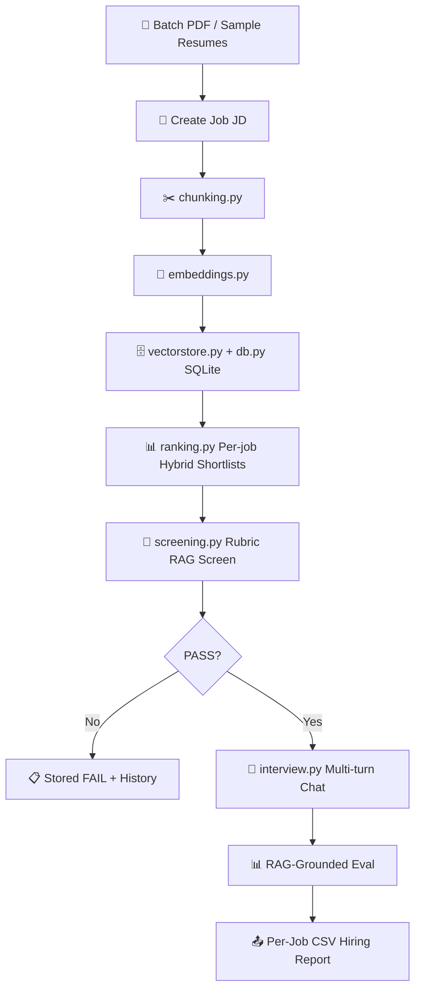

# 💼 Smart AI Recruiter System (RAG Edition)
### 🚀 Phase 2 — Mini-ATS: Jobs · Corpus Ranking · Rubric Screening · Multi-turn Interview


The **Smart AI Recruiter System** is an end-to-end recruitment automation platform built with **Python**, **Gradio**, **ChromaDB**, **SQLite**, **Sentence-Transformers**, and **Groq AI (Llama 3.3 70B)** with **Ollama local fallback**.

> 📘 **Full documentation:** see **[`MANUAL.md`](MANUAL.md)** for the complete project manual — every file, the AI pipeline, the end-to-end user flow, and developer notes.
>
> 🎤 **Interview prep:** see **[`INTERVIEW.md`](INTERVIEW.md)** — a question-and-answer bank covering every part of the system, with the exact numbers, measured results, and bug stories to back each answer.

**Phase 1** added RAG evidence retrieval. **Phase 2** turns that into a mini-ATS workflow: persist jobs/candidates, **multi-job hybrid shortlists**, deep-screen with a weighted rubric, edit/remove candidates, run a multi-turn interview, and export per-job CSV hiring reports.

---

## 🏗️ System Architecture



### Module Breakdown

| Module | File | Purpose |
| :--- | :--- | :--- |
| **Entrypoint** | `app.py` | Launches Gradio on `http://127.0.0.1:7861` (auto-falls back to the next free port if busy). Restores data from the HF backup dataset before the DBs open, then starts the backup timer. |
| **HF Backup** | `backup.py` | Free HF Spaces data survival: tars `users.db` + `data/users/` and pushes to a **private dataset repo** on a timer; restores on boot when the disk is empty. Fail-open no-op without `HF_TOKEN` + `HF_BACKUP_REPO`. |
| **Keepalive** | `.github/workflows/keepalive.yml` | Free GitHub Actions cron that pings the Space URL every 30 min so it never sleeps; UptimeRobot alternative in MANUAL §9. |
| **UI Layer** | `ui.py` | TalentIQ workspace: Jobs → Talent pool → Shortlist → Email → Interview (chat **or** live meeting — free link + live transcript) → History & export. A 👤 icon in the top bar opens the **Profile** bubble (rename, log out, delete account). |
| **Reporting** | `reports.py` | Per-job CSV hiring reports (`exports/`). |
| **Persistence** | `db.py` | SQLite: jobs, candidates, shortlists, screenings, interviews, video_interviews, audit_log. |
| **Accounts** | `auth.py` | Email/password + Google sign-in (standard redirect flow with PKCE — no code entry); each account's data is isolated in its own private storage. |
| **Ranking** | `ranking.py` | Per-job hybrid shortlists (70% semantic + 30% keyword); batch multi-job rank. |
| **Rubric** | `rubric.py` | Weighted dimensions + must-have skills gate. |
| **Interview** | `interview.py` | Multi-turn chat, optional follow-ups, DB-backed transcript/eval — questions & feedback in **English or German** (per-interview language selector). |
| **Live Interview** | `live_interview.py` | Free **Jitsi** meeting links (rooms created on demand) + browser-mic **live transcript** (Groq Whisper in rolling chunks) → Q&A pairs → same RAG evaluator (evaluation in the selected language). |
| **Email** | `emailer.py` | Shortlist notifications + interview invites (optional invite link) over your own free SMTP (Gmail app password). **Each account saves its own SMTP config** (Email tab → ⚙️ Email settings bubble — no `.env` fallback). |
| **RAG Screening** | `screening.py` | Retrieve → rubric JSON → persist screening row. |
| **LLM Engine** | `llm.py` | Groq (`llama-3.3-70b-versatile`) with Ollama fallback. |
| **Vector Store** | `vectorstore.py` | ChromaDB persistence + cosine search. |
| **Reranker** | `rerank.py` | Multilingual cross-encoder `mmarco-mMiniLMv2-L12-H384-v1`. |
| **Retrieval Eval** | `eval_retrieval.py` | Offline evaluation of retrieval quality: labeled resume↔JD set, `recall@k` / `MRR` / `NDCG@k` with and without the reranker (`python eval_retrieval.py`). |
| **Skill Classifier** | `skill_model.py` | **Fine-tuned** tiny-BERT skill classifier (train with `python skill_model.py`) — ranking falls back to skill-category matching when literal keyword overlap is zero (JD says "Amazon Web Services", resume says "AWS"). Fail-open. |
| **Embeddings** | `embeddings.py` | Local multilingual MiniLM-L12 (`paraphrase-multilingual-MiniLM-L12-v2`). |
| **Chunker** | `chunking.py` | Section-aware resume split + JD requirements. |
| **PDF Extractor** | `pdf.py` | `pypdf`. |
| **Sample Data** | `sample_data.py` | JD templates that only fill the create-job form. |

### Rubric Weights

| Dimension | Weight | Notes |
| :--- | ---: | :--- |
| Must-have skills | 40% | Hard gate: must score ≥ 4/10 for PASS |
| Relevant experience | 25% | |
| Projects / impact | 20% | |
| Education / extras | 15% | |
| **PASS threshold** | **≥ 55/100** | Plus must-have gate |

Hybrid ranking (no LLM): `0.7 * semantic + 0.3 * keyword` — use to shortlist, then deep-screen top N.

---

## 🚀 Quickstart Guide

### 1. Activate Environment & Install Dependencies
```powershell
.\.venv\Scripts\activate
pip install -r requirements.txt
```

### 2. Set Groq API Key
Put the key in `.env` only (not exposed in the UI):
```env
GROQ_API_KEY="gsk_..."
```

### 3. Launch TalentIQ
```powershell
python app.py
```
Open **`http://127.0.0.1:7860`** — if that port is busy the app automatically falls
back to the next free one (7861, 7862, 7863, …) and prints which port it picked.

### 4. Create your account
On first run the app shows a **login screen** — sign in or create an account with
email + password (or Google, once configured, see below). **Data is isolated per
account**: each user's jobs, candidates, screenings and interviews live in their own
private folder (`data/users/<user_id>/`), so no account ever sees another's data.
The pre-upgrade local data in `recruiter.db`/`chroma_db/` is automatically claimed by
the **first** account that signs in — nothing is lost. Your login is also **remembered**
across page reloads and server restarts (a session token is stored in the browser and
resolved from `users.db`), so you only sign in once — until the session expires
(`SESSION_TTL_DAYS`, default 30 days) or you log out. Failed sign-ins are rate-limited
per email and per IP to stop brute-force attempts.

### Suggested demo flow
1. **Jobs** → create a requisition (optionally start from a **sample JD** which only fills the form) — every role appears in the open-roles table with its **Req. ID**, candidate/shortlist/screening counts
2. **Jobs** → tick **Select** boxes in the **Open roles** list → **Delete selected listings** to remove roles (and everything tied to them) — deletes happen only from the list, never from a dropdown
3. **Talent pool** → pick the **job listing** first, then ingest PDFs / paste resume text — candidates are automatically linked to that job's pipeline only (no global pool)
4. **Shortlist** → select the job → *Rank* builds its ranked list → set **Top N for interview** → deep-screen candidates with the rubric
5. **Interview** → the dropdown is pre-filled from the job's **top N shortlist**; candidates without a PASS screening are auto-screened on start. Pick the **interview language** (English/German) — questions, follow-ups and evaluations are written in that language
6. **History & export** → per-job activity log + **CSV report per job title** (rank, hybrid scores, screening verdict, interview outcome) via **Download CSV** (one job at a time — no per-candidate exports).

SQLite: `recruiter.db` · Vectors: `chroma_db/` · LLM: `.env` / Ollama

---

## ☁️ Deploy to Hugging Face Spaces (free tier)

The app is a plain **Gradio** app (`ui.py` builds `gr.Blocks`; `app.py` calls
`demo.launch()`), so it runs natively on HF's **Gradio SDK** — no Dockerfile is
needed (none ships with the repo).

> ⚠️ **2026 free-tier reality:** free accounts can no longer create **CPU Basic**
> Gradio Spaces (the selector greys it out) — the only free hardware for a new
> Gradio Space is **ZeroGPU** (2 per free account). ZeroGPU targets GPU demos;
> a CPU-only app like this consumes **0 GPU quota** (quota only ticks inside
> `@spaces.GPU` functions) but waits in a GPU queue for no benefit. The **Docker**
> SDK is now `Paid`.

1. **Create the backup dataset** (free + private, 100 GB):
   https://huggingface.co/new-dataset → name `talentiq-backup` → **Private**.
2. **Create a Write token:** https://huggingface.co/settings/tokens.
3. **Create the Space** at https://huggingface.co/new-space → SDK: **Gradio** →
   hardware: **ZeroGPU** → Create Space.
4. **Push the repo** to the Space (or upload the files directly):
   ```bash
   git init && git add -A && git commit -m "TalentIQ"
   git remote add space https://huggingface.co/spaces/<user>/<space>
   git push space main
   ```
   The Gradio runtime installs `requirements.txt` and runs `app.py` — no code
   changes: it binds `0.0.0.0:$PORT` automatically when `SPACE_ID` is set.
5. **Add Secrets** (Space Settings → Variables and secrets):
   `GROQ_API_KEY` (required), `HF_TOKEN` (the step-2 token), and
   `HF_BACKUP_REPO=<your-username>/talentiq-backup` (enables the backup).
6. The **Live meeting** tab streams the transcript from the browser microphone
   — Spaces serves HTTPS, so mic access works out of the box (allow the
   browser permission prompt).

> 💾 **Data survives for free:** `backup.py` pushes `users.db` + `data/users/` to
> your private dataset repo every 30 min and restores them on boot when the disk
> is empty (a wiped Space) — so accounts and jobs come back intact. Local data is
> never overwritten. Space storage is still ephemeral (sleeps after ~2 days idle;
> first visit pays a cold boot), but a wipe is no longer data loss. Media
> recordings are excluded by default (`HF_BACKUP_INCLUDE_MEDIA=1` to include).

> ⏰ **Never sleeps (free):** the repo ships `.github/workflows/keepalive.yml` —
> a GitHub Actions cron that pings `https://<your-username>-<space-name>.hf.space`
> every 30 minutes so the Space never idles out. Set one repo variable
> (`HF_SPACE_URL`) and you're done; an UptimeRobot monitor (pings every 5 min,
> free tier) is the no-code alternative. Both are documented in MANUAL §9.

### Optional env vars (Space Settings → Variables)

| Variable | Default | Effect |
| :--- | :--- | :--- |
| `GROQ_MODEL` | `llama-3.3-70b-versatile` | Strong model for scoring (screening, evaluation). Pick a faster/cheaper one to cut latency/cost on the free tier. |
| `GROQ_FAST_MODEL` | `llama-3.1-8b-instant` | Cheap model for low-stakes calls (follow-up detection) — scoring stays on `GROQ_MODEL`. |
| `EMBEDDING_MODEL` | `paraphrase-multilingual-MiniLM-L12-v2` | Multilingual embeddings (English + German); switching rebuilds the index on boot. |
| `RERANK_MODEL` | `cross-encoder/mmarco-mMiniLMv2-L12-H384-v1` | Multilingual cross-encoder (English + German) for reranking. |
| `RERANK_ENABLED` | `1` | `0` disables the cross-encoder (saves ~80 MB RAM + CPU time; pure vector retrieval only). |
| `PORT` / `GRADIO_SERVER_NAME` | `7861` / auto | Override the bind address (set automatically on Spaces). If the port is busy the app falls back to the next free one. |
| `GOOGLE_CLIENT_ID` | — | Enables the **Continue with Google** button — the standard redirect flow (browser → Google → back to the app). Create a **Web application** OAuth client and add your app's URL as an **Authorized redirect URI** (e.g. `http://localhost:7861/` locally, `https://<space>.hf.space/` deployed). |
| `GOOGLE_CLIENT_SECRET` | — | Client secret of the same Web application client (required for the redirect flow). |
| `USERS_DB_PATH` | `users.db` | Global identity store (accounts, PBKDF2 password hashes, Google ids). |
| `USER_DATA_DIR` | `data/users/` | Per-account private storage: each user gets `recruiter.db`, `chroma/`, `exports/`, `media/` here. |
| `MAX_PDF_UPLOAD_MB` | `15` | Largest accepted resume PDF (MB); larger files are rejected with a clear message. |
| `HF_TOKEN` | — | HF **write** token — enables the free Space backup (`backup.py`). |
| `HF_BACKUP_REPO` | — | Private dataset repo for backups, e.g. `user/talentiq-backup` (created automatically). |
| `HF_BACKUP_INTERVAL_MIN` | `30` | Minutes between backup pushes. |
| `HF_BACKUP_INCLUDE_MEDIA` | `0` | `1` also archives raw interview recordings (larger, slower pushes). |

> 💡 Free-tier tips: keep the corpus small, prefer `RERANK_ENABLED=0` if the
> Space feels slow, and use `GROQ_MODEL=llama-3.1-8b-instant` for interactive
> demos. Persisted data lives in `recruiter.db` + `chroma_db/` inside the Space.

---

## 🧪 Smoke Check

Launch the workspace and walk the demo flow once to confirm the pipeline:

```powershell
python app.py
```

1. **Jobs** → create a job (sample JDs only fill the form)
2. **Talent pool** → ingest a resume into that job's pipeline
3. **Shortlist** → rank the job, deep-screen a candidate
4. **Interview** → pick a language (English/German) and run one question/answer
   cycle — or switch to **Live meeting** mode, generate a **Jitsi** link, and run
   a live-transcript cycle with the microphone
5. **History & export** → generate the per-job CSV report and open it in Excel

For an automated end-to-end verification (boot the app, then drive it like a
browser with the `gradio_client` — real Groq Whisper + LLM evaluation, needs
`GROQ_API_KEY`):

```powershell
python app.py                                        # terminal 1
.venv/Scripts/python.exe tests/e2e_runtime_verify.py # terminal 2
```

Set `E2E_APP=http://127.0.0.1:<port>` to point it at a non-default port.

---

## 📊 Evaluating Retrieval Quality

The question every ML interview asks — *"how do you know your retrieval works?"*
— is answered with numbers by `eval_retrieval.py`. It runs the **production
retrieval components** (section-aware chunking → embeddings → cosine search →
cross-encoder rerank) over a small **labeled dataset** of 8 resumes ↔ 8
job-description queries (one German resume) and reports standard
information-retrieval metrics **with and without** the reranker:

```powershell
python eval_retrieval.py                 # comparison table, k=5
python eval_retrieval.py --k 3           # top-3 metrics
python eval_retrieval.py --no-rerank     # vector baseline only (no model download)
python eval_retrieval.py --verbose       # per-query breakdown
```

| Metric | What it measures |
| :--- | :--- |
| `recall@k` | Fraction of the truly relevant resumes found in the top-k |
| `MRR` | How early the first relevant resume appears (mean reciprocal rank) |
| `NDCG@k` | Ranking quality vs. the ideal order (binary relevance) |

Metrics are **document-level**: chunk hits are collapsed to the resume with its
best chunk score, mirroring how the product ranks candidates. The rerank path
mirrors production `search_resume` exactly (fetch `max(k·3, 8)` chunks by
cosine, rerank down to `k`). No LLM API calls — purely local models (first run
downloads ~120 MB embeddings and ~470 MB cross-encoder, cached afterwards).
Set `RERANK_ENABLED=0` to also see the app's behavior with reranking off.

---

## 🧠 Fine-Tuned Skill Classifier

A *trained* ML component — not just an API call. `skill_model.py` fine-tunes a
small BERT (`prajjwal1/bert-mini`, 11M params) on a **hand-labeled dataset of
~450 resume skill phrases across 10 categories**, using a from-scratch PyTorch
training loop (warmup schedule, gradient clipping, label smoothing, best-epoch
selection by held-out macro-F1) — no `Trainer`/`accelerate`/`datasets` deps.

```powershell
python skill_model.py          # train + save to data/skill_model (CPU, ~5 min)
python skill_model.py --check  # classify example phrases with the trained model
```

Measured on a 20% held-out split the model reaches **~40% macro-F1 (≈4× random
chance)** — the honest ceiling for ~450 phrases on CPU, and confident
predictions are what production uses.

**Integration:** `ranking._keyword_overlap` falls back to skill-*category*
matching when literal token overlap is zero, so a JD requirement like
"Amazon Web Services" still credits a resume that says "AWS", and
"PostgreSQL" credits "postgres". Purely additive and fail-open — without a
trained model (`SKILL_CLASSIFIER_ENABLED=0`, or an empty `data/skill_model/`)
the pipeline behaves exactly as before.

---

## 📦 Phase Status

| Phase | Goal | Status |
| :--- | :--- | :--- |
| **1** | RAG retrieve → JSON score → evidence UI | Done |
| **2** | Mini-ATS: SQLite, hybrid rank, rubric, multi-turn interview | Done |
| **3a** | Login (email/password + Google) with per-user data isolation | Done |
| **3b** | Persistent sessions (survive reloads & restarts), Docker image, HF Spaces deployment | Done |
| **3c** | Live meeting interviews: free Jitsi link + browser-mic live transcript → Q&A → RAG evaluation | Done |
| **3d** | Per-account email settings (no `.env` SMTP), encrypted-at-rest password, "sends will fail" banner | Done |
